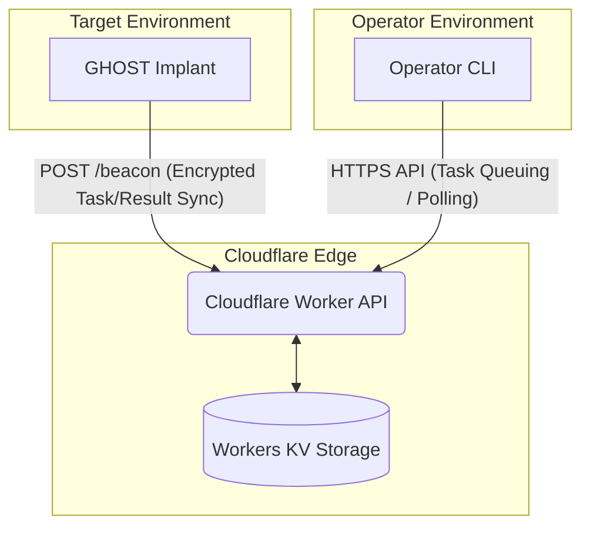

# GHOST: Advanced Windows Implant & C2 Infrastructure

**GHOST** is an advanced, stealthy Windows implant and Command & Control (C2) infrastructure designed for authorized Red Team operations and defensive research. 

It demonstrates state-of-the-art evasion techniques in a fully air-gapped or restricted environment, utilizing a serverless Cloudflare Worker backend for untraceable, highly-resilient communication.

> [!WARNING]
> **Authorized Use Only**: This software is provided strictly for academic research and authorized penetration testing. 

## Features

### Infrastructure
* **Serverless C2**: 100% serverless backend using Cloudflare Workers and KV storage. No static IPs to block, routes through Cloudflare's massive CDN.
* **Asynchronous Beaconing**: "Dead drop" architecture. The implant and operator never communicate directly.
* **Two-Tier Authentication**: Distinct, constant-time verified tokens for Implant Beacons (`BEACON_TOKEN`) and Operator CLI (`OPERATOR_TOKEN`).
* **Operator CLI**: Interactive Python-based shell for session management, task queuing, and result polling.

### Payload (Implant)
* **Direct WinHTTP Transport**: Operates entirely over standard HTTPS (port 443) using the native Windows HTTP stack.
* **Jittered Sleep**: Randomized beacon intervals (45s–180s) to disrupt behavioral network analysis.
* **Encrypted Config**: C2 domain strings are XOR-encrypted and decrypted at runtime using a key derived from the target's FNV-1a hostname hash.
* **GUI Subsystem**: Compiled as a Windows GUI application (`-mwindows`) to run silently without a console window.
* **Statically Linked**: No external CRT dependencies (`/MT` or `-static`), standalone `.exe`.

## Architecture Diagram



## Quick Start

For a complete step-by-step walkthrough of deployment, configuration, building, and running the implant, see the [**START_GUIDE.md**](START_GUIDE.md).

## Project Structure

```text
ghostimplant/
├── src/                # Implant C++ Source
│   ├── main.cpp        # Entry point and payload execution
│   ├── c2.cpp          # WinHTTP transport and beaconing logic
│   ├── utils.cpp       # Crypto, FNV-1a hashing, string conversions
│   └── *.cpp           # Stub implementations (syscalls, evasion)
├── include/            # C++ Headers
├── worker/             # Cloudflare Worker Backend
│   ├── src/index.ts    # Serverless C2 API routing and logic
│   └── wrangler.toml   # Cloudflare deployment configuration
├── server/             # Operator Environment
│   ├── c2_cli.py       # Interactive command line interface
│   └── requirements.txt
├── tools/
│   └── encrypt_domain.py # Generates XOR payload config
├── build.ps1           # Windows MSVC Build Script
├── build.sh            # Linux MinGW Cross-Compile Script
├── START_GUIDE.md      # Step-by-step deployment guide
└── SYSTEM_DESIGN.md    # Advanced architectural and OPSEC documentation
```

## Compilation

You must configure the `BEACON_TOKEN` and the XOR-encrypted domain in `src/c2.cpp` before compiling. See [START_GUIDE.md](START_GUIDE.md) for details.

### Windows (MSVC)
Requires Visual Studio Build Tools (Desktop development with C++).
```powershell
.\build.ps1 -Debug   # Output: build\bin\Debug\ghost.exe
.\build.ps1          # Output: build\bin\Release\ghost.exe
```

### Linux (MinGW-w64 Cross-Compilation)
```bash
sudo apt update && sudo apt install mingw-w64
chmod +x build.sh
./build.sh           # Output: build/ghost.exe
```

## Evasion Technique Reference

> **Note:** Evasion modules are provided as documented stubs with algorithm descriptions. Implementation is left to the researcher per their specific engagement scope.

| Technique | Algorithm | Detection Surface |
|---|---|---|
| **AMSI Bypass** | LoadLibrary `amsi.dll` → GetProcAddress `AmsiScanBuffer` → VirtualProtect RWX → patch `xor eax,eax; ret` | ETW `Microsoft-Antimalware-Scan-Interface`, Sysmon Event ID 7 |
| **ETW Bypass** | GetProcAddress `EtwEventWrite` from ntdll → VirtualProtect RWX → patch `ret` (0xC3) | Kernel ETW provider audit, integrity checking |
| **Direct Syscalls** | Read clean ntdll from disk → parse PE exports → extract SSN from `4C 8B D1 B8 XX XX` pattern → build RWX stubs | Memory scanning for syscall stub patterns |
| **PPID Spoofing** | `InitializeProcThreadAttributeList` → `PROC_THREAD_ATTRIBUTE_PARENT_PROCESS` → `CreateProcess` | Sysmon Event ID 1 (parent PID mismatch) |
| **Module Stomping**| Map legitimate DLL → find .text RVA → VirtualProtect RW → overwrite with shellcode → restore RX | Memory integrity scanning, unbacked executable pages |

---

## Disclaimer

This tool is developed exclusively for **authorized security research and academic purposes**.
It is part of a PhD research project studying EDR evasion techniques and implant architecture.

- Do **not** use this tool against systems you do not own or have explicit written authorization to test.
- The authors are not responsible for misuse.
- All testing should be conducted in **isolated lab environments**.
